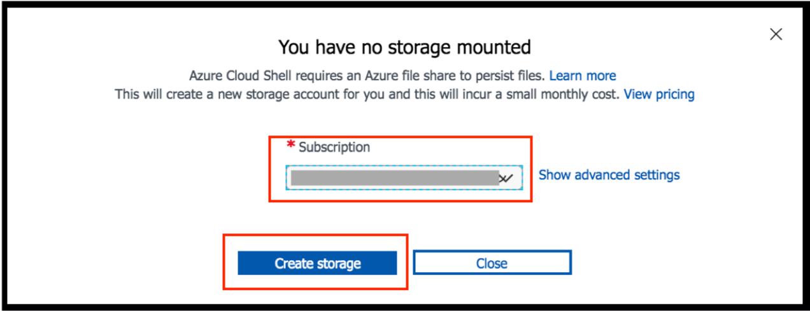
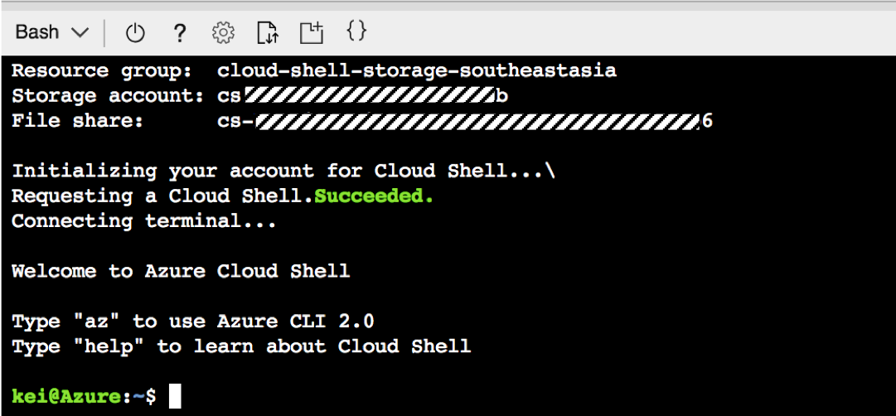
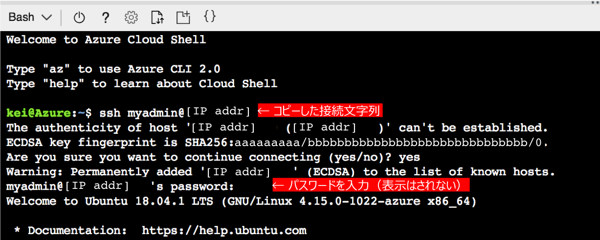

include::variables.yaml[]

## 演習: Cloud Shell (Bash)の設定

*Cloud Shell (Bash)* 環境を設定します。

### タスク1: Cloud Shellの初期設定

. [`>_`] ボタンをクリックしてCloud Shellを開始します。

. Azureポータル画面下部のダイアログで [`Bash(Linux)`] を選択します。
+
image::images/cloudshell-welcome.png[{w50}]

. Cloud Shell用のストレージアカウントに利用するサブスクリプションを選択し[`Create storage`]ボタンをクリックします。
+

. ストレージの作成が完了し、Bashが起動されることを確認します。
+

. VMにSSHでログインする場合は、接続文字列を入力してログインします。
+

