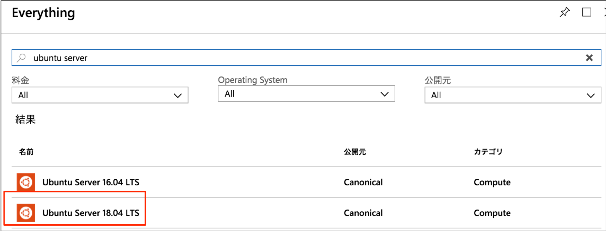
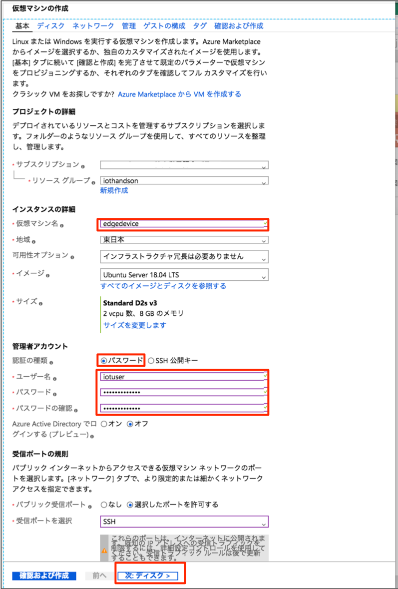
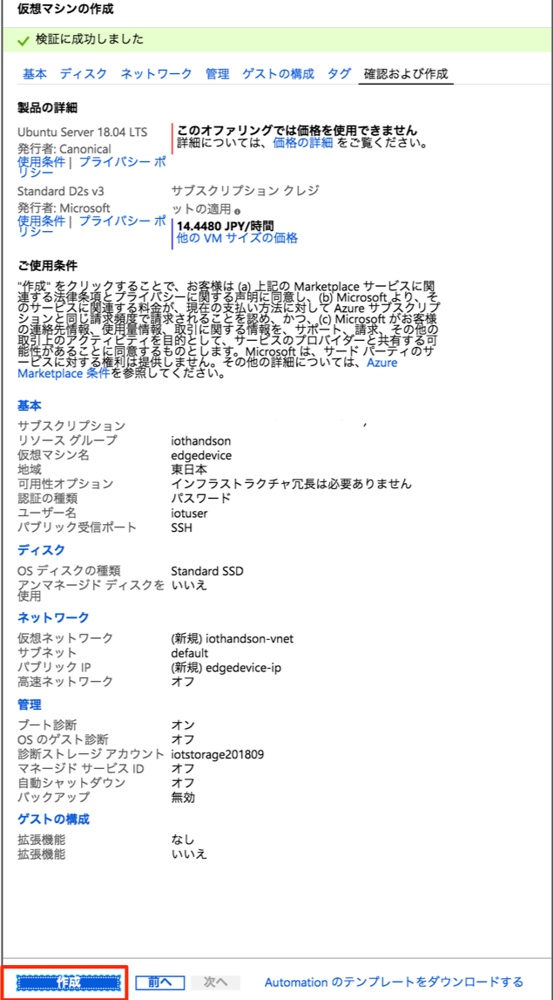
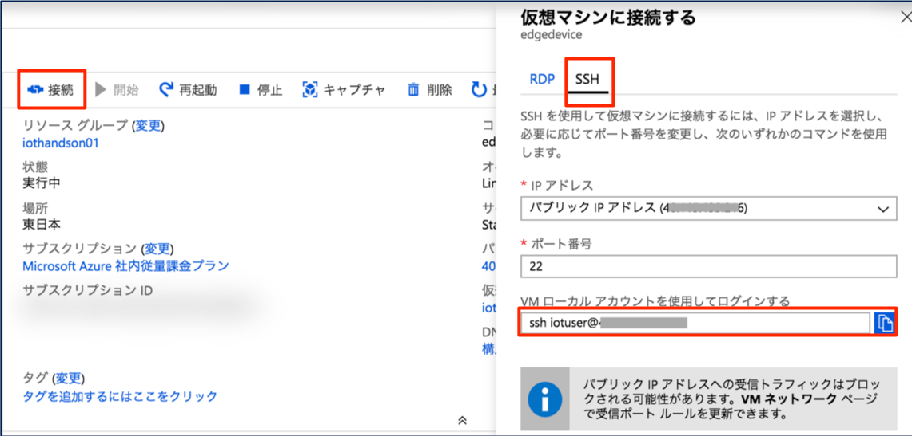
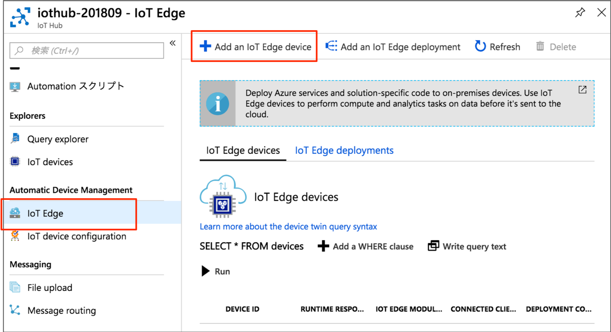
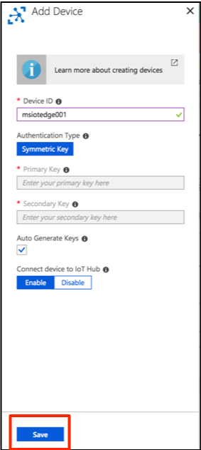
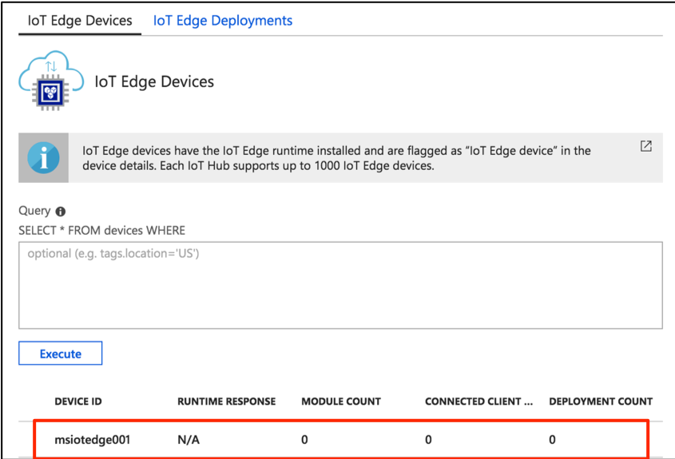
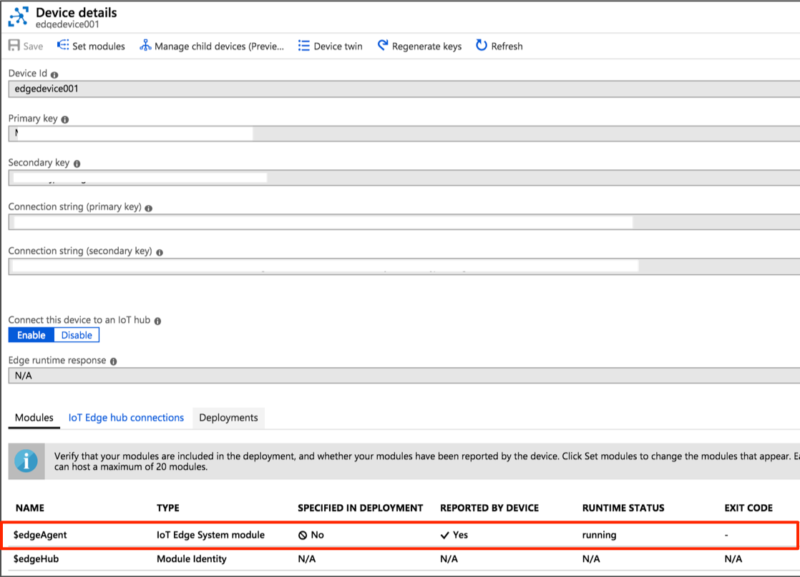
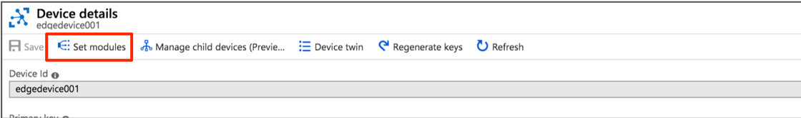
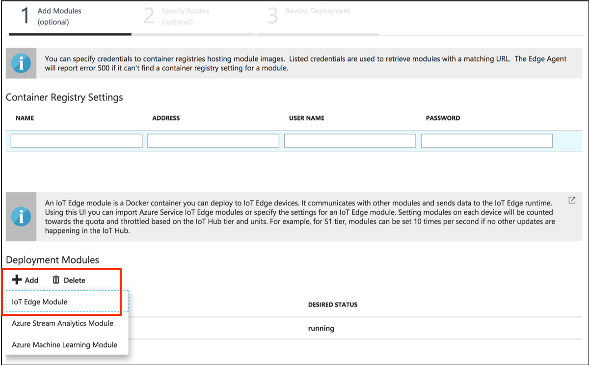

include::variables.yaml[]


## 演習: Azure IoT Edge デバイスの作成

この演習では、Azure上にデプロイしたVM({ubuntu-version})をAzure IoT Edgeデバイスとして作成し、シミュレーションデータ（温度/湿度）をIoT Hubに送信します。

### タスク1：Linux VMのデプロイ

このタスクでは、IoT Edgeデバイスとして動作させる仮想マシン({ubuntu-version})をデプロイします。

. Azure管理ポータル画面のサイドメニューから[リソースグループ]をクリックして、先に作成したリソースグループ(ex. {rg-name})を選択します。

. リソースグループの[追加]をクリックします。

. "ubuntu server"で検索した結果から"{ubuntu-version}"を選択し、[作成]をクリックします。
+


. [基本]で各種項目を設定します。
+
.設定項目と設定値
[cols="2*", options="header"]
|===
|設定項目
|設定値

|サブスクリプション
|利用するサブスクリプションを選択

|リソースグループ
|[既存のものを使用]を選択し、先に作成した {rg-name} を選択

|名前
|任意のマシン名

|場所
|任意の場所を選択

|可用性オプション
|インフラストラクチャ冗長は必要ありません（デフォルトのまま）

|イメージ
|{ubuntu-version}

|サイズ
|（デフォルトのまま）

|認証の種類
|[パスワード]を選択

|ユーザー名
|任意のユーザー名 （例：{vmuser}）

|パスワード
|次の条件を満たす、任意のパスワード （例：{vmpassword}） +
* 12-72文字 +
* 1つの小文字、1つの大文字、1つの数字および "¥"または"-"以外の1つの特殊文字

|Azure Active Directoryでログインする（プレビュー）
|オフ

|パブリック受信ポート
|選択したポートを許可

|受信ポートを選択
|SSH(22)

|===
+


. [ディスク]で各種項目を設定します。
+
.設定項目と設定値
[cols="2*", options="header"]
|===
|設定項目
|設定値

|OSディスクの種類
|HDDまたはSSD

|アンマネージドディスクをしよう
|いいえ

|===
+


. [管理]で各種項目を設定します。
+
.設定項目と設定値
[cols="2*", options="header"]
|===
|設定項目
|設定値

|ブート診断
|オン（デフォルトのまま）

|OSのゲスト診断
|オフ（デフォルトのまま）

|診断ストレージアカウント
|既存または新規作成

|マネージドIDサービス
|オフ（デフォルトのまま）

|自動シャットダウンを有効
|オフ（デフォルトのまま）

|バックアップの有効化
|オフ（デフォルトのまま）

|===
+
image::images/iotedge-vmconfig-disk.png[+


. [概要]で[作成]ボタンをクリックします。
+



### タスク2：コンテナランタイムのインストール

このタスクでは、IoT Edgeデバイス用にデプロイしたVMにIoT Edgeのランタイムをインストールします。

. 接続文字列を確認します。
+
VMのOverviewを開き[接続]をクリックし、右に表示されるダイアログで[SSH]タブを選択します。
Login using VM local accountに記載されている文字列をコピーします。
+


. Cloud Shell またはSSHクライアントでVMに接続します。
+
前の手順でコピーした接続文字列をCloud Shellにペーストしてログインします。
+
====
ssh {vmuser}@[IPアドレス]
====

. root ユーザにスイッチします
+
```
sudo -i
```

. パッケージを取得するリポジトリを設定します。
+
```
curl https://packages.microsoft.com/config/ubuntu/16.04/prod.list > ./microsoft-prod.list
cp ./microsoft-prod.list /etc/apt/sources.list.d/
curl https://packages.microsoft.com/keys/microsoft.asc | gpg --dearmor > microsoft.gpg
cp ./microsoft.gpg /etc/apt/trusted.gpg.d/
```

. コンテナの実行エンジンのMobyをインストールします。
+
※ Moby(http://mobyproject.org) は、オープンソース版のDockerの実行環境です。
+
```
apt-get -y update
apt-get -y install moby-engine
apt-get -y install moby-cli
```

. Moby が正常にインストールされたことを確認します。
+
```
docker run hello-world
```
+
以下のメッセージが表示されれば、mobyが正しくインストールされています。
+
```
Hello from Docker!
This message shows that your installation appears to be working correctly.
```

### タスク3：IoT Edgeデバイスの追加

このタスクでは、IoT HubにIoT Edgeデバイスを新規登録します。

. Azure管理ポータルで、先に作成したIoT Hub {iothub-name} を開きます。

. IoT Edgeをクリックして、[+ Add IoT Edge Device]をクリックします。
+


. Device IDを入力して[Save]ボタンをクリックします
+


. IoT Edge Deviceを選択して接続文字列をコピーしておきます
+

+


### タスク4： IoT Edgeランタイムのインストール

このタスクでは、先にデプロイした Ubuntu VM に IoT Edgeランタイムをインストールします。

Ubuntu VMにSSHでログインして、以降のコマンドを順次実行します。

. SSHでログイン
+
====
ssh {vmuser}@[IPアドレス]
====

. rootユーザにスイッチします
+
```
sudo -i
```

. IoT Edgeパッケージを取得します
+
```
apt-get -y install iotedge
```

. IoT Edgeランタイムを構成します。
+
`/etc/iotedge/config.yaml` を編集して、デバイスの接続文字列を設定します。設定文字列の定義は26行目あたりにあります。
+
`<ADD DEVICE CONNECTION STRING HERE>` を、前のタスクでコピーしておいた接続文字列で置き換えます。

+
.編集前
```
provisioning:
  source: "manual"
  device_connection_string: "<ADD DEVICE CONNECTION STRING HERE>"
```
+
.編集後
```
provisioning:
  source: "manual"
  device_connection_string: "HostName=xxxxx;DeviceId=xxx;SharedAccessKey=xxxxxxxx"
```

. IoT Edgeランタイムを開始します
+
```
systemctl start iotedge
```

. IoT Edgeランタイムのコンテナが動作していることを確認します
+
```
systemctl status iotedge
```

. IoT Edgeランタイムのコンテナログを確認します
+
```
docker ps
docker logs edgeAgent
```
+
`watch -n 10 docker ps` とすると、10秒間隔でdocker psコマンドを実行します。

. Azure管理ポータルから、対象のIoT Edgeデバイスを開き[最新の情報に更新]をクリックします
+
image::images/iotedge-device-refresh.png[]


. デプロイされたモジュール一覧に `$edgeAgent` が追加されていることを確認します
+


### タスク5：IoT Edgeデバイスにシミュレーションモジュールを追加

このタスクでは、IoT Edgeにマイクロソフトが今回するセンサーシミュレーションモジュールを追加します。センサーシミュレーションは、擬似的にテレメトリデータを生成した送信するモジュールです。

. Azure管理ポータルから、対象のIoT Edgeデバイスを開き[Set Modules]をクリックします
+


. Add Modulesの[+追加]-[IoT Edge Module]をクリックします
+

+
IoT Edge Modulesで項目を入力して[Save(保存)]ボタンをクリックします
+
[option=header, cols=2]
|====
|設定項目
|設定値

|名前(name)
|tempsensor

|Image url
|{tempsensor-image-url}
|====

. [Set Module]の画面に戻るので[Next]をクリックします
+


+
この画面では、メッセージのルーティングを定義します。
デフォルトの `"route": "FROM /messages/* INTO $upstream"` では、全てのモジュールの出力メッセージが `$upstream` (IoT Hubを示す予約語）に送信されます。
+


. 次の画面で[Submit]をクリックします

. [Refresh]をクリックして `$edgeHub` (IoT Edgeランタイムモジュールの一つ）と`tempsensor` モジュールが追加されていることを確認します
+

+
tempsensorはシミュレーションデバイス、edgeHubはEdge Hub(IoT Edgeランタイム)を示しています

. IoT EdgeがインストールされたUbuntu VMでDockerコンテナ一覧を確認します。
+
```
docker ps
```

. IoT Edgeランタイム(Edge Hub)コンテナのログを確認します
+
```
docker logs edgeHub
```

. シミュレーションデバイスコンテナのログから、送信メッセージを確認します。
+
```
docker logs tempsensor
```
+
シミュレーションデバイスで生成され、IoT Hubに送信されるデータの例
+
```
[
  {
    "machine": {
      "temperature": 105.82414784646771,
      "pressure": 10.663510514154549
    },
    "ambient": {
      "temperature": 20.848158501250744,
      "humidity": 25
    },
    "timeCreated": "2017-11-28T09:29:34.4441434Z"
  }
]
```
+
IoT Hubに送信されたメッセージは、Time Series Insightsなどで確認することができます。

[NOTE]
====
IoT EdgeにStream Analytics、Machine Learning、Funcsionsのモジュールを使用する場合は、以下のリンクをご参照くださ（チュートリアルメニューの下に各モジュールの設定手順が掲載されています）
https://docs.microsoft.com/ja-jp/azure/iot-edge/
====
