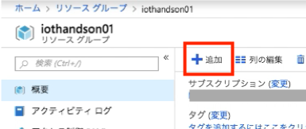
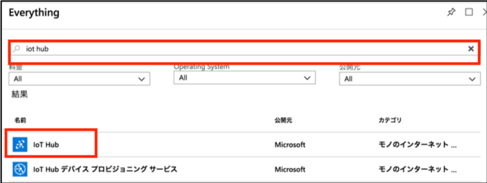
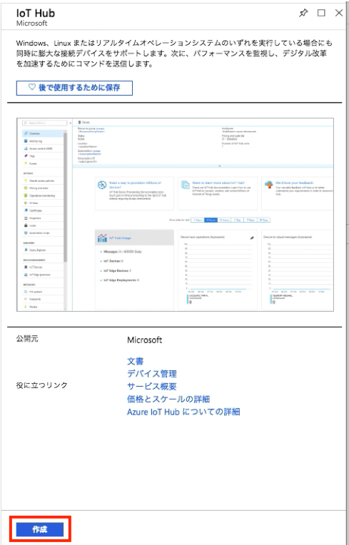
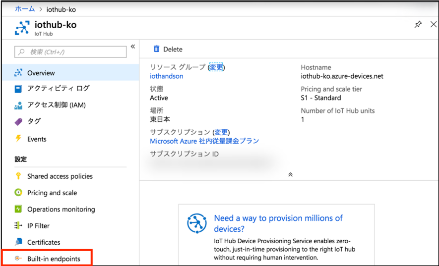
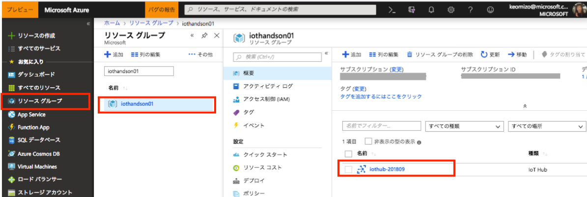
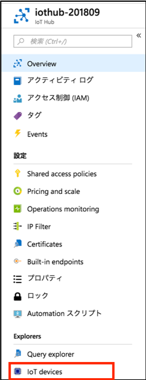
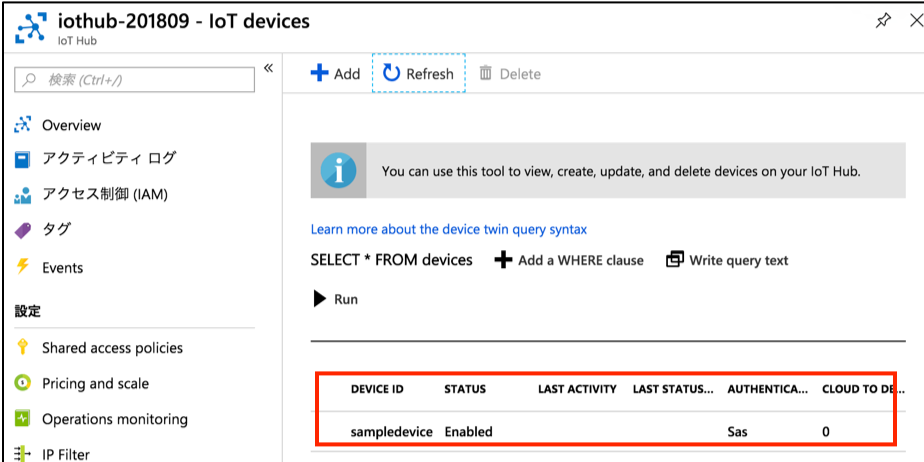
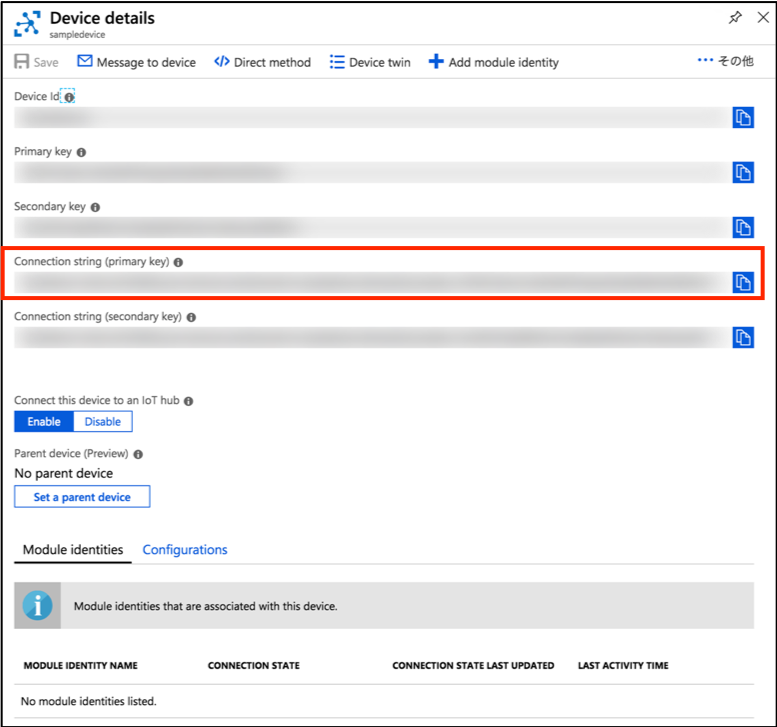

include::variables.yaml[]

## 演習: IoHubとデバイスの接続

この演習では、Azure上にIoT Hubを作成し、デバイスからのメッセージを受信します。
デバイスとしてRaspberry Pi オンライン シミュレーター(Webアプリケーション)を使用し、作成したIoT Hubに温度データと湿度データを送信します。

[NOTE]
====
実際のPCやデバイスからデータを送信する場合、下記リンクに各開発言語/プラットフォーム毎
(Node.js, .NET, Java, Python, iOS)の手順が掲載されています。

https://docs.microsoft.com/ja-jp/azure/iot-hub/
====


### IoT Hubの作成
このタスクでは、デバイスからのデータを受信するIoT Hub を作成します。

. サイドメニューの[リソースグループ]をクリックし、リソースグループ一覧を表示します。

. 「演習：Azure環境の準備」で作成したリソースグループの名前をクリックします。指定したリソースグループのリソース一覧画面が表示されます。（現在は空です）

. [+追加]をクリックします。Everything ウィンドウが表示されます。
+


. “IoT Hub”と入力し、Enter キーを入力します。検索結果が表示されます。[IoT Hub]をクリックします。
+


. IoT Hub の詳細説明ウィンドウが表示されます。ウィンドウ下部の[作成]をクリックします。
+


. IoT Hubの作成ウィンドウが表示されます。各設定項目を入力後、ウィンドウ下部にある[Next: Size and scale]をクリックします。
+
.設定項目と設定値
[cols="2*", options="header"]
|===
|設定項目
|設定値

|サブスクリプション
|ご用意いただいたAzureサブスクリプション（デフォルトのまま）

|リソースグループ
|既存のものを使用
演習１で作成したリソースグループ（デフォルトのまま）

|場所
|東日本 （デフォルトのまま）

|名前
|任意の名前 +
例）{iothub-name} +
※IoT Hubの名前はサービスURLとして使用されるため、**Microsoft Azure全体で一意**の名前を指定する必要があります
|===
+
image::images/iothub-hub-config-basic.png[]

. Size and scale ウィンドウで設定を確認して、ウィンドウ下部の[Review + create]をクリックします。
+
.設定項目と設定値
[cols="2*", options="header"]
|===
|設定項目
|設定値

|価格とスケールティア
|S1 – Standard (デフォルトのまま, IoT EdgeはStandardで利用可能)

|IoT Hub ユニット
|1 （デフォルトのまま）

|Device-to-cloud パーティション
|4 （デフォルトのまま）
|===
+


. [Review + create]ウィンドウで[Create]ボタンをクリックしてIoT Hubを作成します。


. デプロイが開始されると、通知ウィンドウに表示されます。
+

+
image::images/iothub-hub-deployed.png[]

. デプロイが完了すると、通知ウィンドウに完了メッセージが表示されます。[リソースに移動]をクリックし、設定したIoT Hubが作成されていることを確認します。
+


. IoT Hubのメニューから[Endpoints]をクリックします
+


. [エンドポイント]ウィンドウで組み込みエンドポイントの[Events]をクリックしてプロパティを開きます。
+


. [プロパティ]ウィンドウの[消費者グループ]に、既定の `$Default` に加えて2つの消費者グループを追加します。(消費者グループの名前の例 :  `timeseriesinsights` , `streamanalytics` )
+
消費者グループ(コンシューマグループ)は、以降のステップでIoT Hubに送信されたデバイスデータを取得するサービス(Stream Analytics, Time Series Insights)が使用するものです。
+


### IoT Hubへのデバイス登録

このタスクでは、IoT Hubにデータを送信するデバイスを新規登録します。デバイスがIoT Hubにデータを送信するためには、事前にIoT Hubにデバイスを登録しておく必要があります。IoT Hub上でデバイスを新規登録し、デバイスIDとデバイスキー（認証キー）を発行します。

. タスク１で作成したIoT Hubの設定ウィンドウを表示します。
+


. IoT HubのメニューのExplorersのセクションから[IoT devices]をクリックします。
+


. ウィンドウ上部の[+Add]をクリックします。
+


. [デバイスの追加]ウィンドウに{iothub-sample-device-name}と入力し、[Save]をクリックし、デバイスを登録します。ここで登録する文字列がデバイスIDとなります。
+


. [デバイス エクスプローラー]のデバイス一覧に、登録したデバイスが追加されていることを確認します。追加したデバイスをクリックすると、[デバイスの詳細]ウィンドウが表示されます。
+


. [デバイスの詳細]ウィンドウで、デバイスキーや接続文字列の確認や、デバイスツインやデバイスへのメッセージ送信、ダイレクトメソッドが利用できます。ここでは”Connection string (primary key)”の値をコピーしておきます。次のタスクで、コピーした接続文字列をデバイスのプログラムコード内に設定します。
+



### IoT Hubデバイスクライアントの開発

このタスクでは、Raspberry Piオンライン シミュレーターを使ってIoT Hubにデータを送信します。
本エミュレータはRaspberry PiをシミューレートしたWebアプリケーションで、Node.jsでプログラムコードを記述することでIoT Hubにデータを送信することができます。

. Raspberry Pi オンライン シミュレーターの設定
+
https://docs.microsoft.com/ja-jp/azure/iot-hub/iot-hub-raspberry-pi-web-simulator-get-started
+


.. 上記URLをブラウザで開き、[START RAPBERRY PI SIMULATOR]をクリックします。

.. [Step1 Raspberry Pi Web シミュレーターの概要]ウィンドウが開きます。[次のステップ]をクリックします。

.. [Step2 IoT Hubの作成]ウィンドウが表示されます。[次のステップ]をクリックします。

.. [Step3 Pi Web シミュレーターでのサンプルアプリケーションの実行]ウィンドウが表示されます。[私は理解して]をクリックします。

.. [Raspberry Pi Azure IoT Online Simulator]ウィンドウが開きます。

.. 15行目のconnectionStringの’[Your IoT hub device connection string]’を、作成したIoT Hubの接続文字列に変更します。記載方法は[]までを書き換えます。’コピーした接続文字列’となります。
+
.変更前
```
const connectionString = '[Your IoT hub device connection string]';
```
+
.変更後
```
const connectionString = ' HostName=iothub0910-001.azure-devices.net;DeviceId=sampledevice;SharedAccessKey=xxxxxxxxxxxxxxxxxxxxx ';
```

.. 23行目～37行目にあるfunction getMessage(cb)を下記に書き換えます。シミュレーションデバイスが生成したデータ(機械: 温度/圧力,大気: 温度/湿度)をJSONで返します。
+
```
function getMessage(cb) {
  messageId++;
  sensor.readSensorData()
    .then(function (data) {
      cb(JSON.stringify({
        messageId: messageId,
        deviceId: 'Raspberry Pi Web Client',
        machine : { temperature : data.temperature_C, pressure : 10 },
        ambient : { temperature : data.temperature_C, humidity : data.humidity }
      }), data.temperature_C > 30);
    })
    .catch(function (err) {
      console.error('Failed to read out sensor data: ' + err);
    });
}
```

.. 画面下部の[Run]ボタンをクリックします。画面左のLEDが点滅していれば動作しています。
またコンソールウィンドウに送信したテレメトリデータが表示されることを確認します。
+
エラーが発生せず、下記のように表示されていれば成功です。Webアプリケーションを閉じるか
[Stop]ボタンをクリックするまでテレメトリデータは送信され続けます。
+
```
Sending message: {"messageId":1,"deviceId":"Raspberry Pi Web Client","machine":{"temperature":23.61089154634202,"pressure":10},"ambient":{"temperature":23.61089154634202,"humidity":73.80948916321065}}
>
Message sent to Azure IoT Hub
>
```

### IoT Hubでのデータ受信確認

このタスクでは、作成したIoT Hubの[概要]をクリックし、使用状況を表示します。メッセージがカウントアップされていればデバイスからのテレメトリデータが受信できています。


