include::variables.yaml[]

## 演習：Power BIでのデータ表示

この演習では、Stream AnalyticsからのストリーミングデータをPower BIでリアルタイム表示します。
Stream AnalyticsにPower BI用の出力を追加し、Power BI側でストリーミングデータセットとして扱います。

### タスク1：Stream Analyticsの出力設定（PowerBIへの出力）

. Stream Analyticsを停止します。

. Stream Analyticsの新規出力設定でpowerbiを追加します。
+
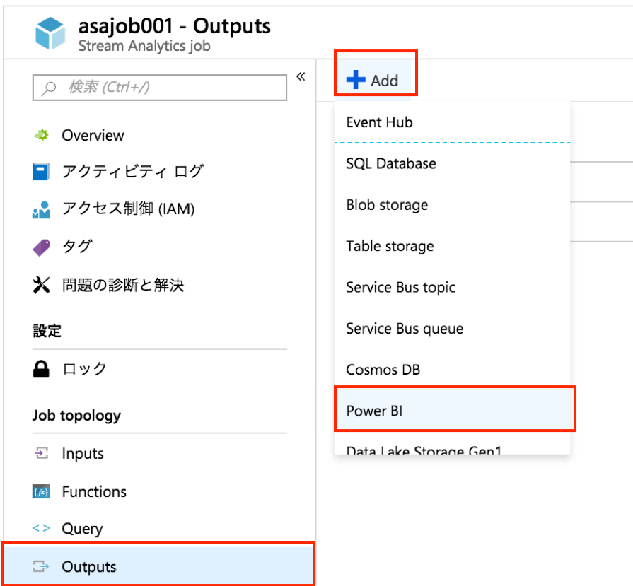

. 設定項目を入力後、Power BIの[Authorize]をクリックし、Power BIユーザーでサインインします。別のブラウザウィンドウが起動します。
+
.設定項目と設定値
[cols="2*", options="header"]
|===

|設定項目
|設定値

|出力エイリアス +
Output alias
|任意の名前 +
例) powerbi

|グループワークスペース +
Group workspace
|My workspace

|データセット名 +
Dataset name
|任意の名前 +
例）{pbi-dataset-name}

|テーブル名 +
Table name
|任意の名前 +
例）{pbi-table-name}

|===
+
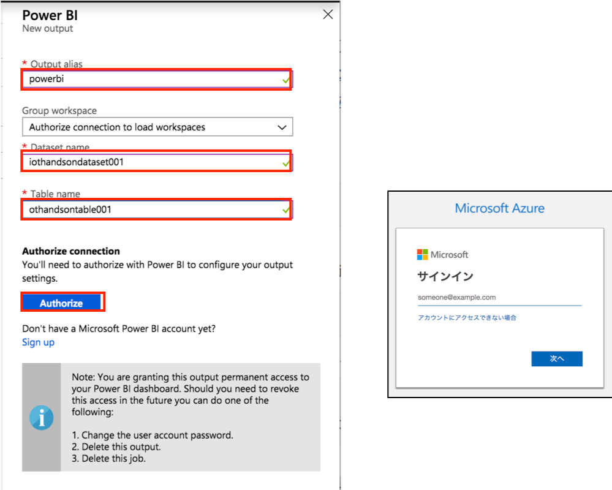

. Power BIの認証が完了したら、[Save]をクリックします。
+
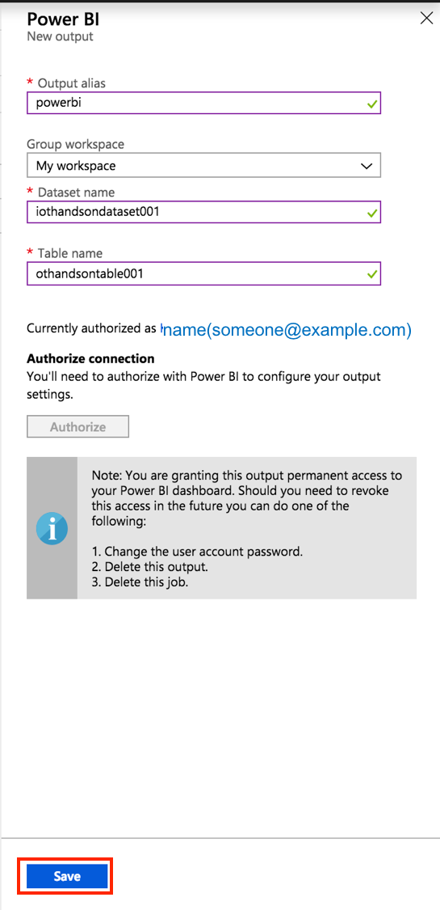
+
[TIP]
====
下記URLに詳細説明の記載があります。
https://docs.microsoft.com/ja-jp/azure/stream-analytics/stream-analytics-power-bi-dashboard
====

. Stream Analyticsのクエリの末尾にPower BI出力用のクエリを追加します。過去15秒間のデバイス毎の温度/湿度の平均値を取得してPower BIにプッシュで出力します。
+
```
WITH [averagedata] AS (
    SELECT
      	IoTHubStream.IoTHub.ConnectionDeviceId as deviceId,
        ambient.temperature as temperature,
        ambient.humidity as humidity
    FROM
        [IoTHubStream]
)

SELECT
    deviceId,
    AVG(temperature) as temperature,
    AVG(humidity) as humidity,
    System.Timestamp as time
INTO
    [sqldatabase]
FROM
    [averagedata]
GROUP BY
    deviceId, TumblingWindow(minute, 1)

SELECT * INTO [blobstorage] FROM [IoTHubStream]

SELECT
    deviceId,
    AVG(temperature) as temperature,
    AVG(humidity) as humidity,
    System.Timestamp as time
INTO
    [powerbi]
FROM
    [averagedata]
GROUP BY
    deviceId, TumblingWindow(second, 15)
```
 
. クエリを設定後、ジョブを開始します。
+
Stream AnalyticsのOverviewで[Start]をボタンをクリックします。
+
image::images/asa-startjobbutton.png[{w50}]
+
ダイアログで[Start]ボタンをクリックしてJobをスタートします。
+
image::images/asa-startjob.png[{w20}]

. Power BIにログインします。
+
https://powerbi.microsoft.com/ にアクセスし、上部の[サインイン]をクリックしてサインインします。
+


. サイドメニューからマイワークスペースを開き、ウィンドウ右上の[+作成]をクリックします。
+
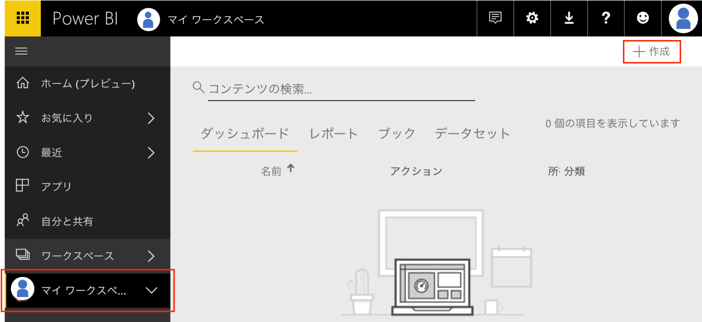

. [ダッシュボード]を選択し、任意の名前を設定します。（例： {pbi-dashboard-name} ）
+
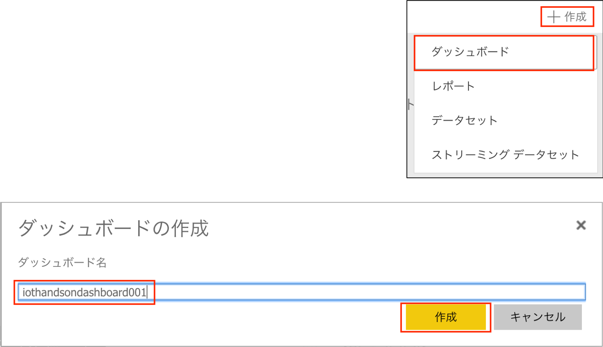

. ウィンドウ上部の[+タイルの追加]をクリックし、リアルタイムデータ欄の[カスタムストリーミングデータ]を選択し、[次へ]をクリックします。
+
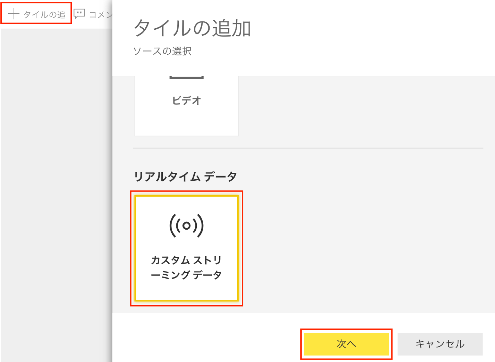
 
. Stream Analyticsのデータセット名に設定したデータセット（例：{pbi-dataset-name}）が、データセット欄に表示されていることを確認してください。表示されていればこれを選択し、[次へ]をクリックします。
+
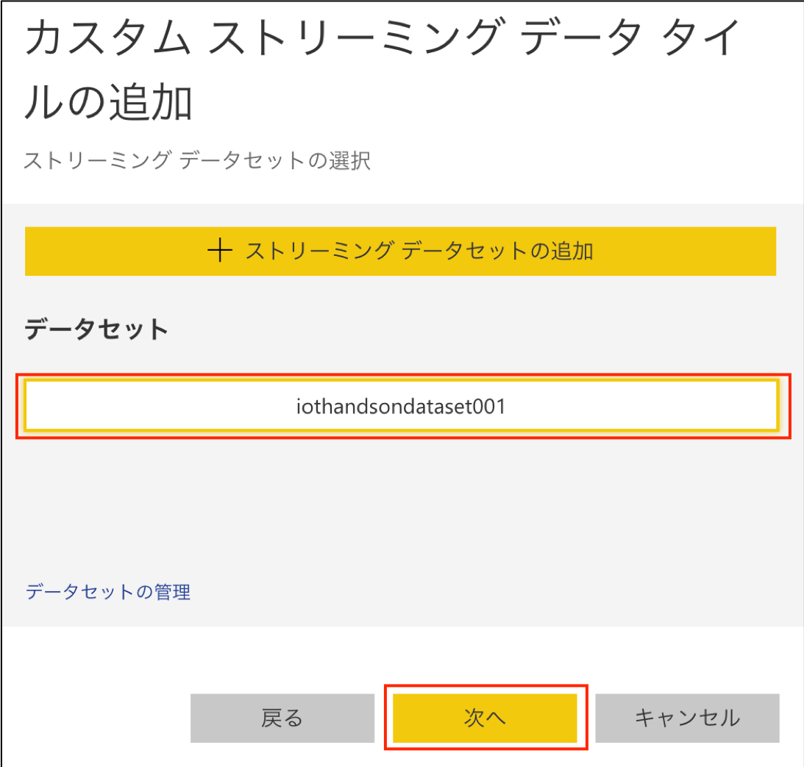
+
[CAUTION]
====
Stream Analyticsジョブが正常に動作していないと、データセットとして表示されません。
====

. 視覚化タイプで[カード]を選択し、フィールドタブの[+値の追加]をクリックします。
+
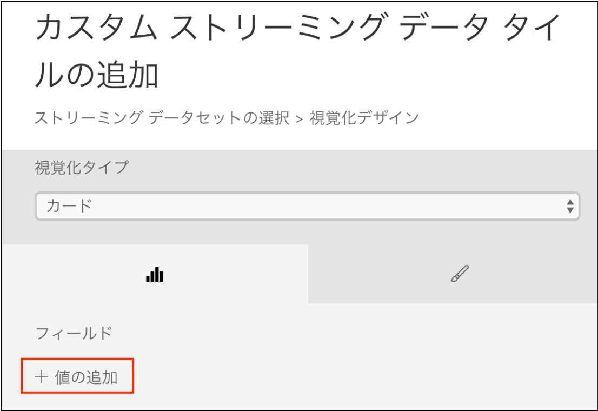

. プルダウンから”temperature”を選択します。
+
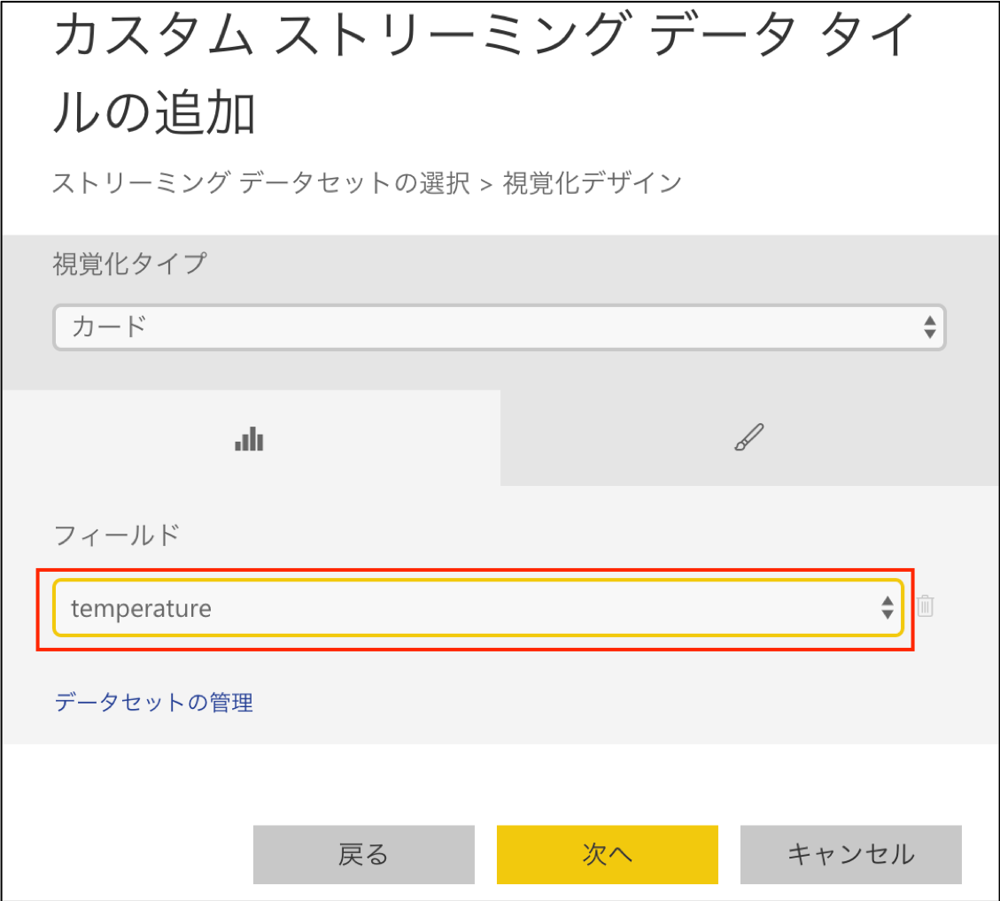

. データラベルのタブを選択し、[小数点以下桁数の値]を設定します。(例: “2”)
+
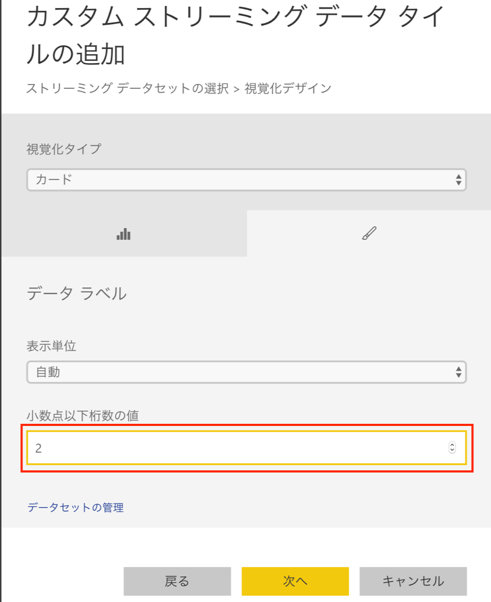

. ウインドウ下部の[次へ]をクリックします。
+


. [タイトル]、[サブタイトル]に任意の文字列をして、[適用]をクリックします。
+
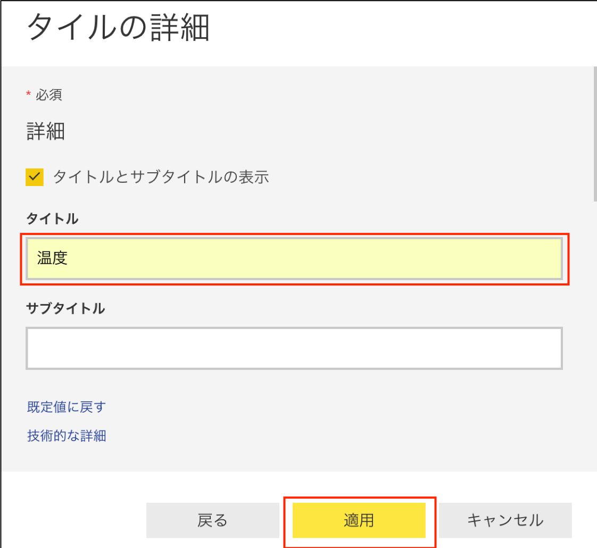
+
[CAUTION]
====
ダイアログ表示されますが、少し待っていると表示されなくなります。
すぐに非表示にしたい場合は、右上の×ボタンをクリックしてください。

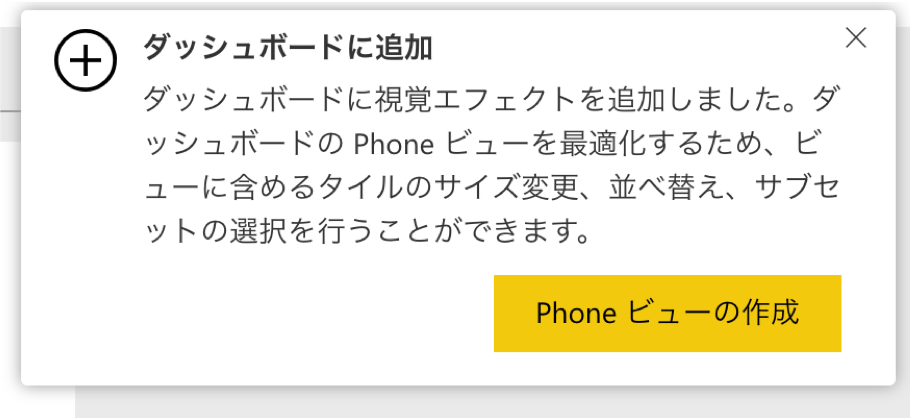
====

. 目的に応じて、ダッシュボードを完成させてください。
+
[TIP]
====
Power BI サービスのダッシュボードの詳細は、下記をご参照ください。
https://powerbi.microsoft.com/ja-jp/documentation/powerbi-service-dashboards/
====

. タイルの視覚化タイプに”折れ線グラフ” を選択した場合

.. [+タイルの追加]をクリックし、タイルの追加(ソースの選択）画面で[カスタムストリーミングデータ]を選択し、[次へ]をクリックします。
.. カスタムストリーミングデータタイルの追加（ストリーミングデータセットの選択）画面でデータセットを選択し、[次へ]をクリックします。
.. カスタムストリーミングデータタイルの追加（ストリーミングデータセットの選択＞視覚化デザイン）画面で、折れ線グラフを選択しパラメータを入力します、
+
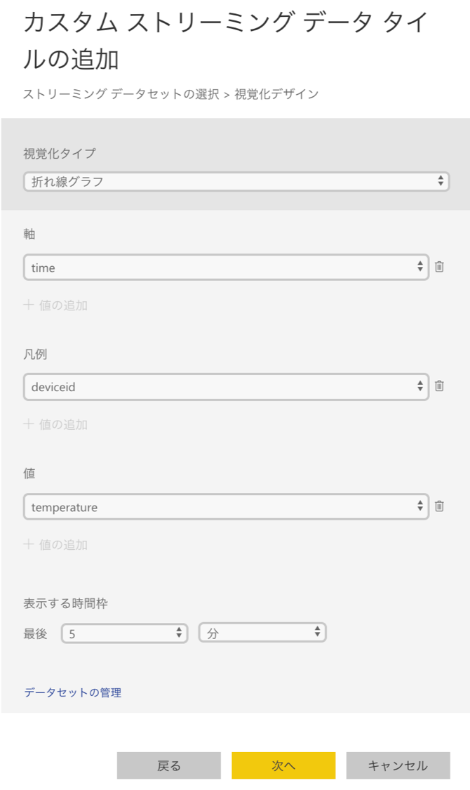
+
.設定項目と設定値
[cols="2*", options="header"]
|===

|設定項目|設定値

|軸|time
|凡例|deviceid
|値|temperature
|表示する時間枠|最後 : ５分

|===
+
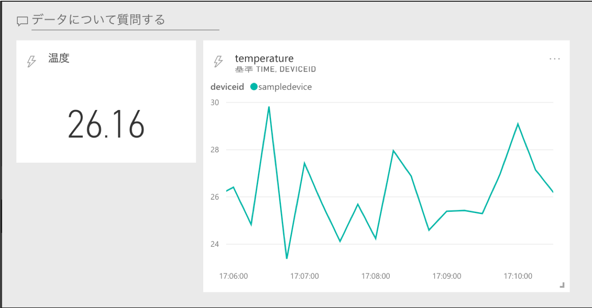
