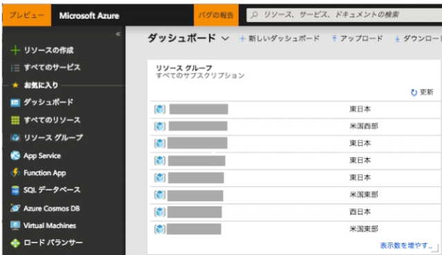
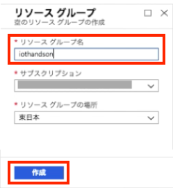

include::variables.yaml[]

## 演習:Azure環境の準備

### Azureポータルへのアクセス

このタスクでは、Azureを操作するために、WebブラウザでAzureポータルにアクセスします。

.	ブラウザでAzure管理ポータルにアクセスします。
https://portal.azure.com

.	ログイン画面に取得いただいたマイクロソフトアカウントの[メールアドレス]と[パスワード]を入力して、[サインイン]ボタンをクリックします。
+

.	管理ポータルにログインできたことを確認してください。

### リソースグループの作成

このタスクでは、リソースグループを作成します。リソースグループでは関連するサービスを同一の
リソースグループ内にまとめて管理することができます。

. サイドメニューの[リソースグループ]をクリックします。
+

.	[＋追加]をクリックします。リソースグループ作成ウィンドウが表示されます。
+

. 下記の項目を設定します。各設定項目を入力後、ウィンドウ下部にある[作成]をクリックします。
+
.設定項目と設定値
[cols="2*", options="header"]
|===
|設定項目
|設定値

|リソースグループ名
|{rg-name} +
※任意の値でも構いません +
※ただし、サブスクリプション内で一意の名前にする必要があります +
※緑のチェックマークが表示されれば重複していません +

|サブスクリプション
|ご用意いただいたAzureサブスクリプション（デフォルトのまま）

|リソースグループの場所
|東日本
|===
+

. リソースグループ画面の[更新]をクリックします。設定したリソースグループが追加されていることを
確認してください。
+

