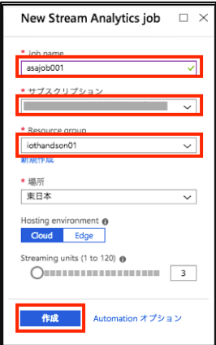
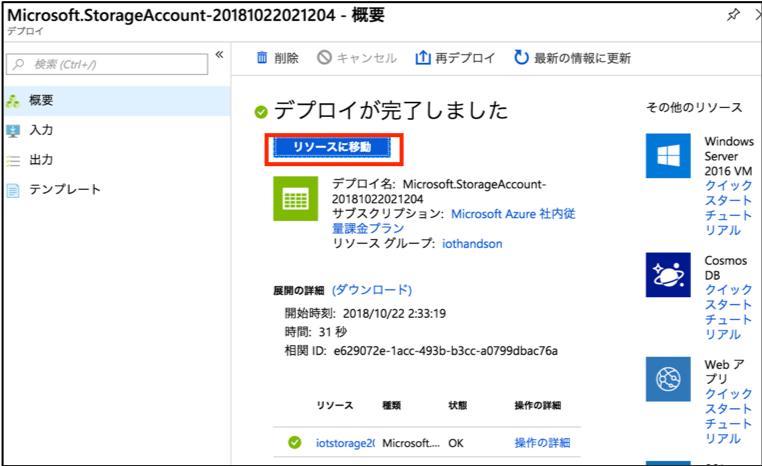
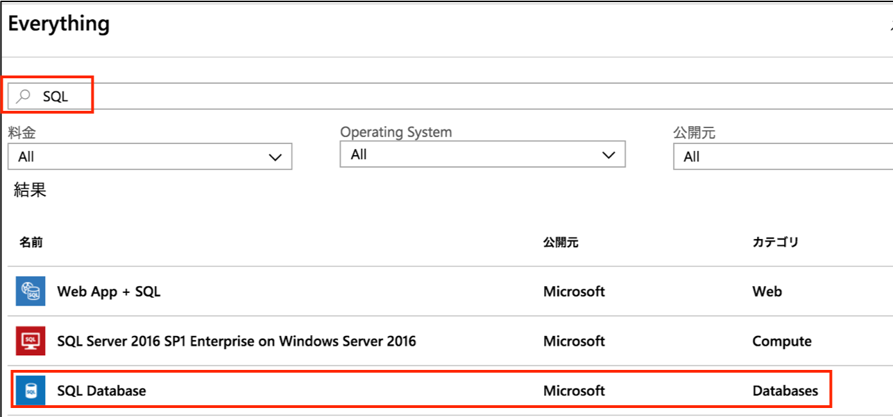
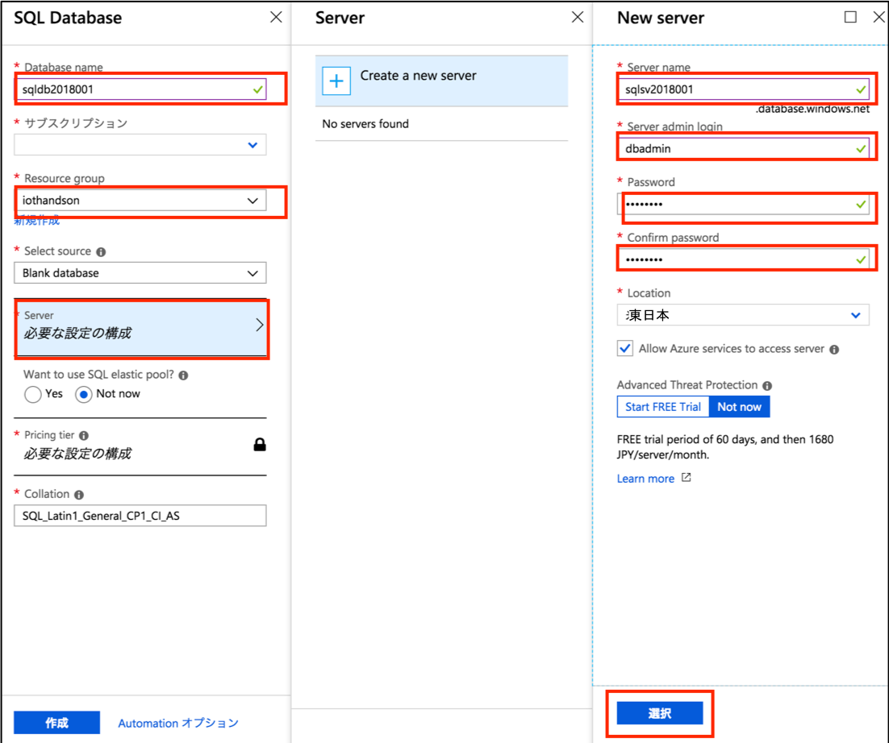
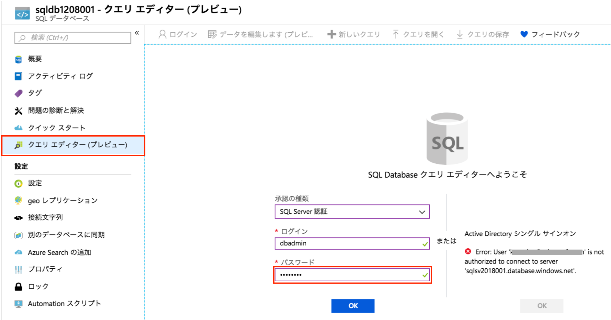
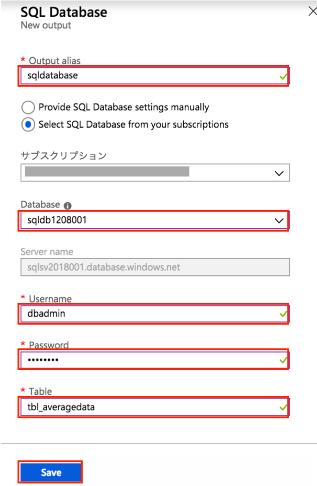

include::variables.yaml[]

## 演習: Stream Analyticsによるリアルタイムデータ加工

この演習では、Stream Analyticsにより、リアルタイム分析とBlob Storageへのデータ格納を行います。様々なリアルタイムデータ処理を実現することができます。ここでは、個別データと1分単位のサマリデータを出力するように設定します。

[NOTE]
====
Stream Analyticsの詳細は、下記URLに記載があります。

https://docs.microsoft.com/ja-jp/azure/stream-analytics/
====


### Stream Analyticsの作成
このタスクでは、Azure上にStream Analyticsを作成します。

. 「演習：Azure環境の準備」で作成したリソースグループを表示し、ウィンドウ上部の[+追加]をクリックします。
+
image::images/asa-asa-add.png[]

. Everythingウィンドウの検索ボックスで、”Stream Analytics”と入力しEnterキーを押します。
+


. [Stream Analytics job]をクリックし、表示された詳細ウィンドウ下部の[作成]をクリックします。
+


. [新しい Stream Analytics ジョブ]ウィンドウの各設定値を入力後、ウィンドウ下部にある[作成]をクリックします。
+
[cols="2*", options="header"]
.設定項目と設定値
|===
|設定項目
|設定値

|ジョブ名 +
Job name
|任意の名前 +
例） {asa-job-name} +

|サブスクリプション
|ご用意いただいたAzureサブスクリプション（デフォルトのまま）

|リソースグループ +
Resource group
|既存のものを使用 +
「演習:Azure環境の準備」で作成したリソースグループ

|場所
|東日本（デフォルトのまま）

|ホスティング環境 +
Hosting environment
|Cloud（デフォルトのまま）

|ストリーミングユニット +
Streaming units
|3（デフォルトのまま）

|===
+


. デプロイが完了すると、通知ウィンドウに完了メッセージが表示されます。[リソースに移動]をクリックし、設定したStream Analyticsが作成されていることを確認します。


### Stream Analyticsの入力設定

このタスクでは、作成したStream Analyticsに[入力](Stream Analyticsへの入力データ)を設定します。

. 「タスク：Stream Analyticsの作成」で作成したStream Analyticsの設定ウィンドウを表示します。
+
[サイドメニュー] > [リソースグループ] > [作成したリソースグループ] > “作成したStream　Analyticsの名前”
+


. Stream Analyticsの設定メニューにある[Inputs]をクリックし、ウィンドウ上部の[+Add stream input]-[IoT Hub]をクリックします。
+


. [新規入力]ウィンドウの各設定値を入力後、ウィンドウ下部にある[作成]をクリックします。
+
.設定項目と設定値
[cols="2*", options="header"]
|===

|設定項目
|設定値

|入力のエイリアス +
Input alias
|任意の名前 +
指定した名前は後述のクエリの構文内で参照 +
例){asa-input-alias-name-iothub}

|インポートオプション +
○Provide IoT Hub settings manually +
●Select IoT Hub from your subscriptions
|Select IoT Hub from your subscriptions（デフォルトのまま）

|サブスクリプション
|ご用意いただいたAzureサブスクリプション（デフォルトのまま）

|IoT Hub
|「演習：IoT Hubとデバイスの接続」で作成したIoT Hubを選択

|エンドポイント +
Endpoints
|Messaging

|共有アクセスポリシー名 +
Shared access policy name
|iothubowner (デフォルトのまま)

|共有アクセスポリシーキー +
Shared access policy key
|デフォルトのまま

|コンシューマーグループ +
Consumer group
|「演習：IoT Hubとデバイス接続」で追加したStream Analytics用のコンシューマーグループ +
{iothub-endpointname-asa}

|イベントシリアル化形式 +
Event serialization format
|JSON (デフォルトのまま)

|エンコード+
Encoding
|UTF-8（デフォルトのまま）

|イベントの圧縮タイプ +
Event compression type
|None

|===
+


. 通知ウィンドウに「入力のテスト中」と表示されます。「接続テストが成功しました」と表示されれば、入力の追加完了です。


### Stream Analyticsの出力設定（ストレージへの出力）

このタスクでは、作成したStream Analyticsに出力を設定します。デバイスから送信された全データを
Azure Blobストレージに保存します。

. 「演習：Azure環境の準備」作成したリソースグループを表示し、ウィンドウ上部の[+追加]をクリックします。
+


. Everythingウィンドウの検索ボックスで、”ストレージ”と入力しEnterキーを押します。[ストレージアカウント]をクリックします。
+


. 表示された詳細ウィンドウ下部の[作成]をクリックします。
+


. 下記のとおり、各設定値を入力後、ウィンドウ下部にある[作成]をクリックします。
+
.設定項目と設定値
[cols="2*", options="header"]
|===

|設定項目
|設定値

|名前
|任意の名前. Microsoft Azure全体で一意の名前 +
例) {asa-storage-name}

|デプロイモデル
|Resource Manager（デフォルトのまま）

|アカウントの種類
|BLOBストレージ

|場所
|東日本

|レプリケーション
|ローカル冗長ストレージ（デフォルトのまま）

|パフォーマンス
|Standard（デフォルトのまま）

|アクセス層
|ホット（デフォルトのまま）

|安全な転送が必須
|無効

|サブスクリプション
|ご準備いただいたサブスクリプション

|リソースグループ
|既存のものを使用 +
「演習:Azure環境の準備」で作成したリソースグループ

|仮想ネットワーク
|無効

|Data Lake Storage Gen2（プレビュー）
|何もしない

|===
+


. リソースグループ内に作成したストレージアカウントが追加されていることを確認します。
+


. Stream Analyticsの設定メニューにある[出力]をクリックし、ウィンドウ上部の[+Add]-[Blob storage]をクリックします。
+


. [新規出力]ウィンドウの各設定値を入力後、ウィンドウ下部にある[作成]をクリックします。
+
.設定項目と設定値
[cols="2*", options="header"]
|===
|設定項目
|設定値

|出力エイリアス +
Output alias
|任意の名前. 指定した名前は後述のクエリの構文内で参照 +
例) {asa-blob-name}

|インポートオプション +
○Provide IoT Hub settings manually +
●Select IoT Hub from your subscriptions
|Select IoT Hub from your subscriptions（デフォルトのまま）

|インポートオプション
|サブスクリプションからBlob Storageを選択する

|サブスクリプション
|ご準備いただいたサブスクリプション

|ストレージアカウント +
Storage account
|当タスクで作成したストレージアカウントを選択する

|ストレージアカウントキー +
Storage accountkey
|自動入力

|コンテナ指定方式 +
●Create new +
○Use existing
|Create new（デフォルトのまま）

|コンテナー名 +
Container
|任意の名前 +
例）{asa-blog-container-name}

|パスパターン
|出力パスを設定する +
例) `output/{date}/{time}`

|日付の形式 +
Date format
|形式を選択する。ここでは `YYYY-MM-DD` を選択

|時刻の形式 +
Time format
|形式を選択する

|イベントシリアル化形式 +
Event serialization format
|JSON

|エンコード +
Encoding
|UTF-8asa-querystorage-query.png

|フォーマット +
Format
|Line separated

|===
+


### Stream Analyticsのクエリ設定（ストレージへの出力）

このタスクでは、Stream Analyticsにストレージ出力するクエリを設定します。

. Stream Analyticsの設定メニューにある[クエリ]をクリックします。
+


. 右側のウィンドウ内のクエリを修正し、[Save]をクリックします。
+
```
SELECT * INTO [blobstorage] FROM [IoTHubStream]
```
+
image::images/asa-querystorage-edit.png[]

. Stream Analyticsの設定メニューにある[Overview]をクリックし、ウィンドウ上部にある[Start]をクリックします。
+


. [ジョブの開始]ウィンドウが表示されたら、ウィンドウ下部の[Start]をクリックします。
+
image::images/asa-startjob.png[]

. 通知ウィンドウで正常にStream Analyticsジョブが開始されたかを確認します。（１～２分かかります）
+


. 指定したストレージにテレメトリデータが保存されていることを確認します。
+
「演習：Azure環境の準備」で作成したリソースグループを表示し、作成したストレージアカウントを表示します。[ストレージアカウント]ウィンドウ内のサービス欄の[BLOB]をクリックします。
+


. 作成したコンテナ内に指定したパスが作成され、データが保存されていることを確認します。
+


. ファイル名を選択後、ウィンドウ上部の[BLOBの編集]をクリックし、データを確認します。
+


. データを確認後、Stream Analyticsジョブを停止しておきます。
+


### Stream Analyticsの出力設定（SQLデータベースへの出力）

このタスクでは、作成したStream Analyticsに出力を追加します。SQLデータベースに1分間の平均値を保存します。

. 「演習:Azure環境の準備」で作成したリソースグループを表示し、ウィンドウ上部の[+追加]をクリックします。
+


. Everythingウィンドウの検索ボックスで、”SQL”と入力しEnterキーを押します。[SQL Database]をクリックし、表示された詳細ウィンドウ下部の[作成]をクリックします。
+

+


. 下記のとおり、各設定値を入力後、ウィンドウ下部にある[作成]をクリックします。
+
.設定項目と設定値
[cols="2*", options="header"]
|===

|設定項目
|設定値

|データベース名
|任意の名前 +
例) {sqldb-db-name}

|サブスクリプション
|ご準備いただいたサブスクリプション（デフォルトのまま）

|リソースグループ
|既存のものを使用

|ソースの選択
|空のデータベース（デフォルトのまま）

|サーバー
|[必要な設定の構成]をクリックし、次の「新しいサーバーの作成」に記載の内容を入力。

2+|**新しいサーバーの作成**

|サーバー名
|任意の名前。Azure全体で一意の名前。
例）{sqldb-server-name}

|サーバー管理者ログイン
|任意の管理者IDを設定 +
例）`{sqldb-admin-usernam}`

|パスワード
|任意の管理者パスワードを設定 +
例）`{sqldb-admin-password}`

|パスワードの確認
|パスワードと同じ文字列を設定

|場所
|東日本（デフォルトのまま）

|Azureサービスにサーバーへのアクセスを許可する
|チェック（デフォルトのまま）

|Advanced Thread Protection
|後で（デフォルトのまま）

2+|〜**新しいサーバーの作成の項目はここまで** 〜

|SQLエラスティックプールを使用しますか？
|後で（デフォルトのまま）

|価格レベル
|[必要な設定の構成]をクリックし、[Basic]をクリック後、下部の[適用]をクリック

|照合順序
|SQL_Latin1_General_CP1_CI_AS（デフォルトのまま）

|===

+

+


. リソースグループ内に作成したSQLデータベースが表示されていることを確認します。
+


. SQLデータベースのメニューから[クエリエディタ]を選択肢, [パスワード]を入力後、[OK]をクリックします。
+
.設定項目と設定値
[cols="2*", options="header"]
|===

|設定項目
|設定値

|承認の種類
|SQL Server認証（デフォルトのまま）

|ログイン
|データベース作成時に指定したユーザー名 +
例）{sqldb-admin-username}　（デフォルトのまま）

|パスワード
|データベース作成時に指定したパスワード +
例）{sqldb-admin-password}

|===
+


. 1分平均値を格納するテーブル”{sqldb-average-tablename}”を作成します。
+
[クエリ１]に下記のSQLを入力し、[実行]をクリックします。テーブル一覧を更新し、テーブルが正常に作成されていることを確認します。
+
```
create table tbl_averagedata(
    deviceId nvarchar(50),
    temperature float,
    humidity float,
    time nvarchar(50)
)
go
```
+


. Stream Analyticsの設定メニューにある[Output]をクリックし、ウィンドウ上部の[+Add]-[SQL Database]をクリックします。
+
image::images/asa-outputsql-adddb2asa.png[]

. [新規出力]ウィンドウの各設定値を入力後、ウィンドウ下部にある[作成]をクリックします。
+
.設定項目と設定値
[cols="2*", options="header"]
|===

|設定項目
|設定値

|出力エイリアス
|任意の名前 +
例) {asa-output-alias-name-sqldb}

|シンク
|SQLデータベース

|インポートオプション
|サブスクリプションからSQLデータベースを選択する

|データベース
|作成したデータベースを選択 +
例）{sqldb-db-name}

|サーバー名
|自動入力

|ユーザー名
|SQL Database作成時に指定した管理ユーザー +
例）{sqldb-admin-username}

|パスワード
|SQL Database作成時に指定したパスワード +
例）{sqldb-admin-password}

|テーブル
|{sqldb-average-tablename}

|===
+



### Stream Analyticsのクエリ設定（SQLデータベースへの出力）

このタスクでは、Stream AnalyticsにSQLデータベースに出力するクエリを追加します。

. Stream Analyticsの設定メニューにある[Query]をクリックします。
+


. 右側のウィンドウ内のクエリを追加し、[保存]をクリックします。
+
WITH句の中でIoT Hubにデータを送信したデバイス名を取得し(`deviceId`)、過去1分間のデバイス毎の温度/湿度の平均値を取得してSQLデータベースに出力します。
+
```
WITH [averagedata] AS (
    SELECT
      	IoTHubStream.IoTHub.ConnectionDeviceId as deviceId,
        ambient.temperature as temperature,
        ambient.humidity as humidity
    FROM
        [IoTHubStream]
)

SELECT
    deviceId,
    AVG(temperature) as temperature,
    AVG(humidity) as humidity,
    System.Timestamp as time
INTO
    [sqldatabase]
FROM
    [averagedata]
GROUP BY
    deviceId, TumblingWindow(minute, 1)

SELECT * INTO [blobstorage] FROM [IoTHubStream]
```
+

 
. Stream Analyticsの設定メニューにある[Overview]をクリックし、ウィンドウ上部にある[Start]をクリックします。
+


. [ジョブの開始]ウィンドウが表示されたら、ウィンドウ下部の[Start]をクリックします。
+
image::images/asa-startjob.png[]

. 通知ウィンドウで正常にStream Analyticsジョブが開始されることを確認します(数分かかります)。
 
. SQLデータベースに格納されたデータを確認します。SQLデータベースの[クエリエディター]で、テーブルを選択し、[データを編集します]をクリックして1分間隔に集計されたデータを確認します。
+

+
[新しいクエリ]でSQLを直接入力して[実行]ボタンをクリックしてデータ一覧を確認することもできます。
+
```
select * from dbo.tbl_averagedata order by time
```

. データを確認後、Stream Analyticsジョブを停止しておきます。
+

