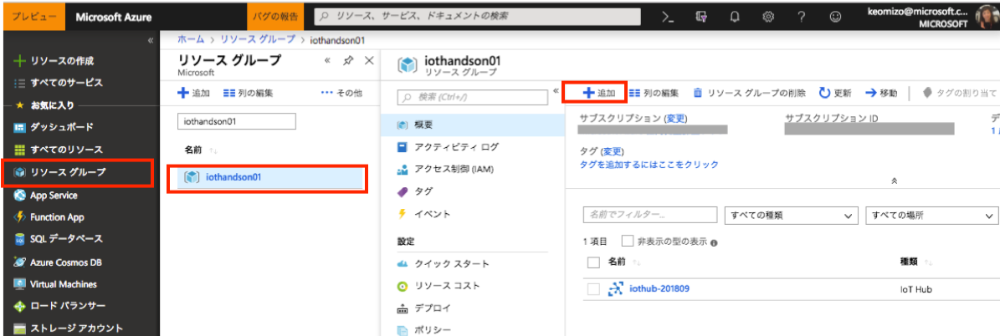
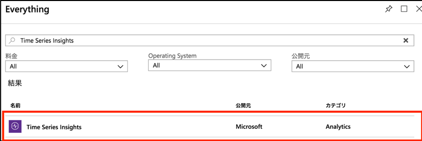
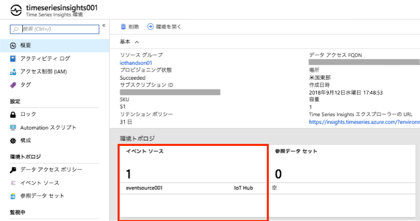
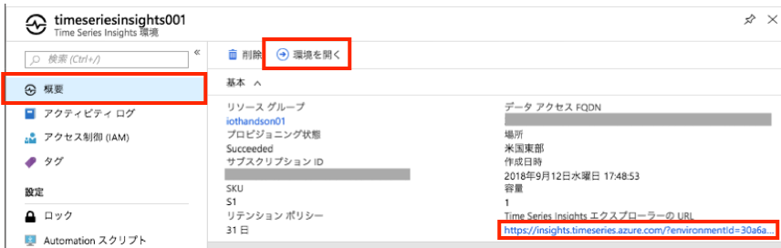

include::variables.yaml[]

## 演習: Time Series Insightsによるデータの可視化

この演習では、IoT Hubで受信したデータをTime Series Insightsで表示します。

[NOTE]
====
Time Series Insightsの詳細は下記URLに記載があります。

https://docs.microsoft.com/ja-jp/azure/time-series-insights/time-series-insights-overview
====

Time Series Insights は時系列データを念頭に設計されたデータベースです。ほぼリアルタイムでのデータ探索が可能です。またTime Series Insights REST API を使用して新しいカスタム ソリューションを作成することもできます。既定のリテンション期間は31日間となっており、最大400日のデータ リテンション期間を構成できます。

### タスク1：Time Series Insightsの作成

このタスクでは、Azure上にTime Series Insightsを作成します。

. 「演習:Azure環境の準備」で作成したリソースグループを表示し、ウィンドウ上部の[+追加]をクリックします。
+

. Everythingウィンドウの検索ボックスで、”Time Series Insights”と入力しEnterキーを押します。

. [Time Series Insights]をクリックします。
+

. 表示された詳細ウィンドウ下部の[作成]をクリックします。
+

. Time Series Insights environmentウィンドウの各設定値を入力後、ウィンドウ下部にある[作成]をクリックします。
+
.設定項目と設定値
[cols="2*", options="header"]
|===
|設定項目
|設定値

|環境名
|任意の名前 +
例）{tsi-tsiname}

|サブスクリプション
|ご用意いただいたAzureサブスクリプション（デフォルトのまま）

|リソースグループ
|「演習：Azure環境の準備」で作成したリソースグループを選択

|場所
|米国西部（デフォルトのまま）

|SKU
|S1（デフォルトのまま）

|Capacity
|1（デフォルトのまま）

|===
+

. デプロイが開始されると、通知ウィンドウに表示されます。

. デプロイが完了すると、通知ウィンドウに完了メッセージが表示されます。[リソースに移動]をクリックし、設定したTime Series Insightsが作成されていることを確認します。
+

### タスク2：Time Series Insightsの設定

このタスクでは、作成したTime Series Insightsに、「演習: IoT Hubとデバイスの接続」で作成したIoT Hubをイベントソースに設定します。

. タスク１で作成したTime Series Insightsの設定ウィンドウを表示します。
[サイドメニュー] > [リソースグループ] > [作成したリソースグループ] > [作成したTime Series Insights]

. Time Series Insightsの設定メニューにある[イベントソース]をクリックします。ウィンドウ上部の
[+追加]をクリックします。
+

. [イベントソース]ウィンドウの各設定値を入力後、ウィンドウ下部にある[作成]をクリックします。
+
.設定項目と設定値
[cols="2*", options="header"]
|===
|設定項目
|設定値

|イベントソース名 +
Event source name
|任意の名前 +
例) {tsi-eventsource-name}

|ソース +
Source
|IoT Hub

|インポートオプション +
Import option
|使用可能なサブスクリプションから…（デフォルトのまま） +
Use IoT Hub from available subscription

|サブスクリプションID +
Subscription Id
|ご用意いただいたサブスクリプション（デフォルトのまま ）

|IoT Hub名 +
IoT hub name
|「演習:IoT Hubのデバイス接続」で作成したIoT Hub名 +
ex) {iothub-name}

|IoT Hubポリシー名 +
IoT hub policy name
|自動入力のまま (iothubowner)

|IoT Hubポリシーキー +
Iot hub policy key
|自動入力のまま (********)

|IoT Hub コンシューマグループ +
Iot hub consumer group
|{iothub-endointname-tsi} +
(IoT Hubで追加したコンシューマグループ)

|Event serialization format
|自動入力のまま (JSON)

|Timestamp property name
|空白のまま

|===
+

. [イベントソース]ウィンドウに追加したイベントソースが表示されていることを確認します。確認後、右上の[`×`]ボタンをクリックして[イベントソース]ウィンドウを閉じます。Time Series Insights概要ウィンドウの”イベントソース”が ”1” となります。
+

. 以下のようなデータアクセスポリシーの警告が表示される場合、データアクセスポリシーを追加します。
+

+
Tim Series Insightsのメニューから[データアクセスポリシー]をクリックします。
+

.. データアクセスポリシーウインドウで、ユーザーが一件も登録されていないことを確認して[追加]をクリックします。
+

.. [ユーザー役割の選択]ウィンドウで[ユーザーの選択]をクリックして、Azure管理ポータルにログインしたご自身のアカウント(Azure管理ポータルの右上に表示)を検索して追加します。
+

.. [ユーザー役割の選択]ウインドウで[ロールを選択する]をクリックして、[共同作成者]を選択して[OK]をクリックします。
+

.. ユーザーとロールの選択後, [OK]をクリックします。

.	データ保持期間やキャパシティを設定する場合には、[構成]メニューをクリックします。
+
容量やデータリテンション期間（日）を必要に応じて設定します。
+

### タスク3：Time Series Insightsでのデータ表示とカスタマイズ

このタスクでは、作成したTime Series Insightsエクスプローラーへアクセスし、IoT Hubで受信した
温度データと湿度データを表示します。

. 作成したTime Series Insightsを表示します。

. [概要]ウィンドウ上部の[環境を開く]をクリックします。[Time Series Insights エクスプローラーのURL]がURLになります
+

. Time Series Insightsのポータル画面が表示されます。

. 温度データを表示するために、サイドメニューのMEASUREプルダウンを”Events”から”ambient.temperature”に変更します。
+

. 湿度データを追加するために、サイドメニューの[Add]をクリックし、MEASUREプルダウンを”Events”から”ambient.humidity”に変更します。
+

. より詳細なデータを確認するために、表示期間を調整します。紫色の両端をドラッグアンドドロップし、範囲を調整します。ポータル左上のメニューからも範囲設定ができます。
+

. 左サイドメニューの[Interval size]を設定すると、グラフの描画粒度を調整することができます。Interval sizeごと平均の値がグラフに描画されています。

. 表示するプロパティが１つの場合、ヒートマップを表示することができます。”ambient.humidity”のグラフ表示設定を削除し、[HEATMAP]タブをクリックします。ヒートマップは多くのデバイスを表示する際のデータ傾向把握に有効です。
+

