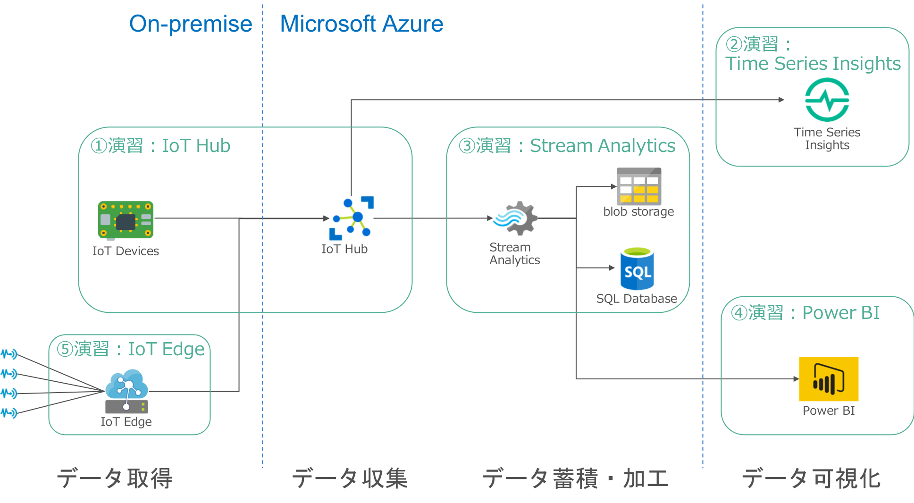

include::variables.yaml[]

# Azure IoT テクニカルワークショップ
Global Blackbelt Sales Microsoft Corporation
Sept-2018
:toc:

## このハンズオンについて
### 概要
このハンズオンでは、Microsoft Azure IoTサービスを使用してIoTアプリケーション（データの収集／加工／視覚化）をチュートリアル形式で構築します。
Azure IoTアーキテクチャをハンズオン形式で理解し、実現するシステムの構成をイメージできるようになることを目的とします。

### 必要な準備
Webブラウザから無線LANで接続可能なPCを必ず準備してください。

下記リンクから無償環境を取得いただけます。 +
https://azure.microsoft.com/ja-jp/free/

Power BIの環境を事前に取得の上、ご参加いただきますようお願いします。
下記リンクから評価版の環境を取得いただけます。 +
https://powerbi.microsoft.com/ja-jp/documentation/powerbi-service-self-service-signup-for-power-bi/

下記リンクに本ハンズオンで使用するコードやコマンドを掲載していますのでご活用ください。 +
https://msjpiot.blob.core.windows.net/docs/Snippet.txt

### ハンズオンで構築するIoTサービスのついて

<<<
include::azure-cloudshell.adoc[]
include::azure-prepare.adoc[]
<<<

include::azure-iot-hub.adoc[]
<<<

include::azure-timeseries-insights.adoc[]
<<<

include::azure-streamanalytics.adoc[]
<<<

include::azure-powerbi.adoc[]
<<<

include::azure-iot-edge-deploy.adoc[]

以上で、ハンズオンは終了です。お疲れ様でした！！
