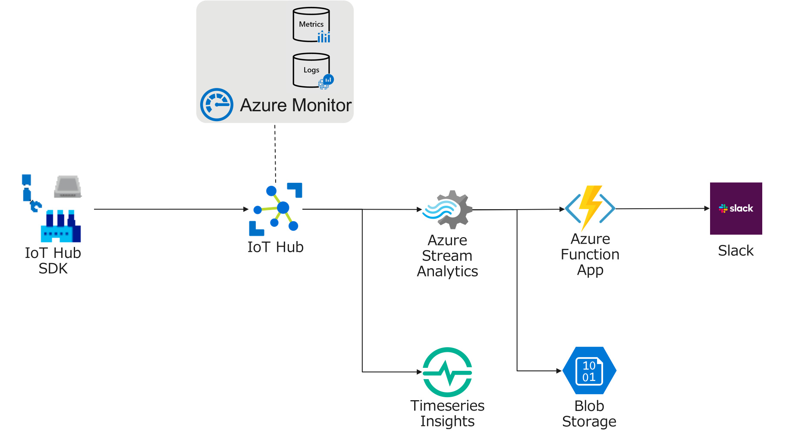
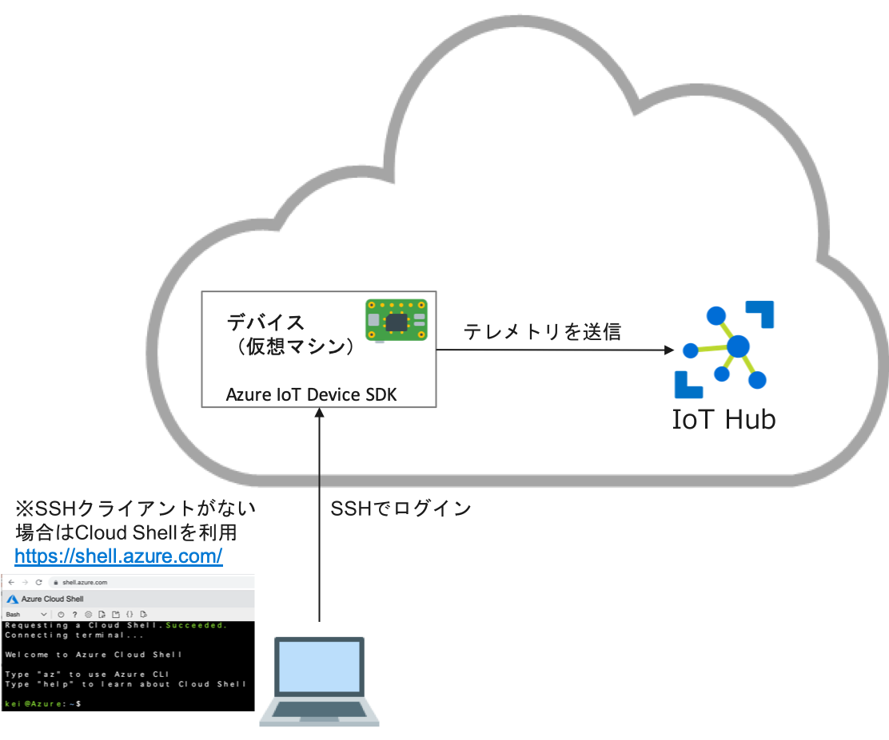

## Azure IoT ハンズオン

## 目的
Azure IoTと関連するサービスを利用して、テレメトリデータの保存や他サービスとの連携を行なっていきます。。

IoT Deviceのアプリケーションは、Azure IoT Device SDK(Python)を利用したサンプルプログラムを、Azure Function Appは C#Scriptを利用したサンプルプログラムを利用します。

## 対象
Azure IoTを利用したサービスの設計や開発に興味のある人。

## 利用するサービス

* link:https://azure.microsoft.com/ja-jp/services/iot-hub/[Azure IoT Hub]
* link:https://azure.microsoft.com/ja-jp/services/stream-analytics/[Azure Stream Analytics]
* link:https://azure.microsoft.com/ja-jp/services/functions/[Azure Function Apps]
* link:https://azure.microsoft.com/ja-jp/services/virtual-machines/[Linux VM]
* link:https://azure.microsoft.com/ja-jp/services/monitor/[Azure Monitor]
* link:https://code.visualstudio.com/[Visual Studio Code]
* link:https://marketplace.visualstudio.com/items?itemName=vsciot-vscode.azure-iot-toolkit[VSCode Azure IoT Toolkit]

## 実習に必要な環境
* AzureのSubscription
* Azureポータルが利用可能なブラウザ
* SSHのクライアントまたはAzure Cloud Shell

## 目次

. link:prepare_azure.adoc[Azure環境の準備]
+
本演習で利用するAzureのリソースグループの作成を行います。

. link:iot_device_app.adoc[IoT Deviceアプリケーションの開発]
+
IoT HubのデプロイおよびIoT DeviceでのサンプルアプリケーションとIoT Hubの接続を行います。

. link:using_vscode.adoc[VSCodeを利用したメッセージのモニタリング]
+
Visual Studio Codeを利用して、デバイスからIoT Hubに送信されたメッセージをモニターします。

. link:asa.adoc[Stream Analyticsの利用]
+
Stream Analyticsを利用して、受信したテレメトリデータをBlobへ保存をします。

. link:module_twin.adoc[モジュールツインの利用]
+
一つのデバイスで実行されるモジュールごとに異なるIDで IoT Hubに接続します。

. link:iot_device_app_ext.adoc[IoTデバイスの証明書認証]
+
IoT Hubに接続するデバイスを証明書を利用して認証します。

. link:monitor_and_alert.adoc[Azure Monitorの利用]
+
Azure Monitorを利用して、Azure IoT Hubを監視しします。

. link:timeseries_insights.adoc[Timeseries Insightsでの可視化]
+
IoTデバイスから送信されたテレメトリデータの可視化を行います。

. link:function_send_msg_to_slack.adoc[Functionから他のサービスにメッセージを送信する]
+
Stream Analyticsの出力先に指定したAzure FunctionsからSlackにメッセージを送信します。
