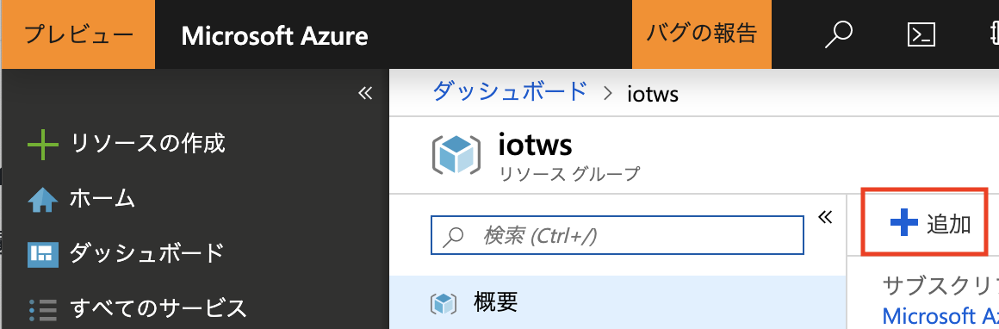
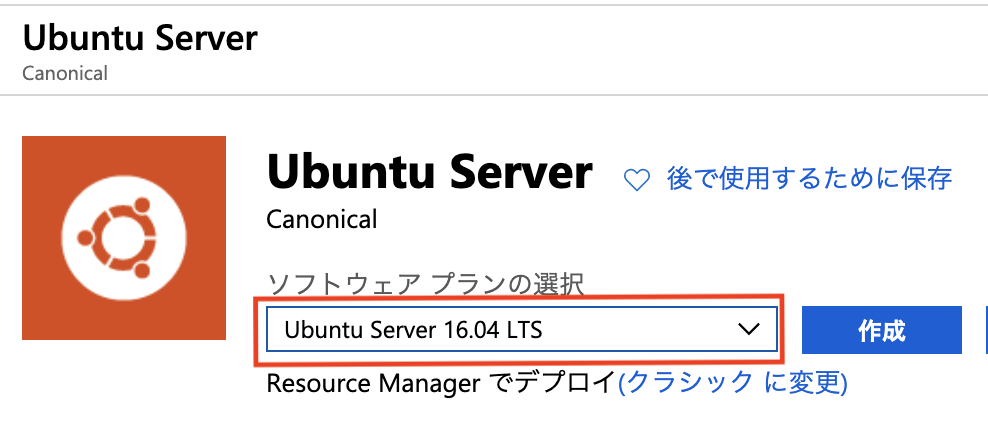
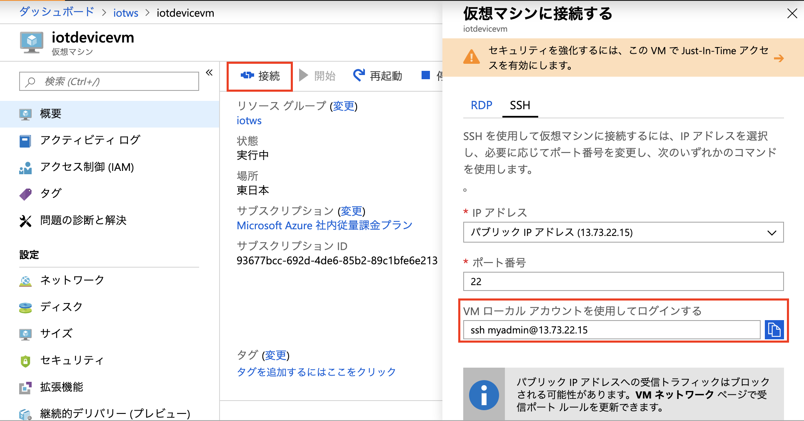
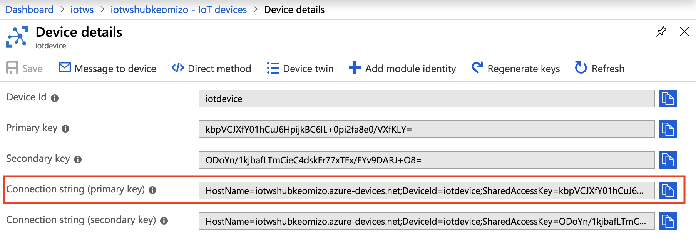

link:agenda.adoc[目次]

## 演習：IoT Device サンプルアプリケーションの実行

AzureにIoT Hubと仮想マシン（IoTデバイスとして利用）をデプロイし、IoTデバイスからIoT Hubへの接続を設定していきます。

### タスク1: IoT Hubの作成

このタスクでは、本演習で利用するリソースグループにIoT Hubを作成しデバイスを登録します。

. Azureポータル画面で本演習で利用するリソースグループ（例. _iotws_）を選択します。

. Azureポータル画面右Paneの上部の[+追加]をクリックします。
+


. 検索フィールドに `IoT Hub` と入力し、検索結果の一覧から[IoT Hub]を選択します。

. IoT Hub作が画面の[作成]をクリックします。

. ウィザードで必要なパラメータを入力していきます。
+
.基本の設定値と項目
[cols="2*", options="header"]
|===
|設定項目
|設定値

|サブスクリプション
|本演習で利用するAzureサブスクリプション

|リソースグループ
|例）_iotws_ +
本演習で利用するリソースグループを選択します

|リージョン
|例）東日本 +
※任意のリージョンを選択します

|IoT Hub名
|例）_iothub1234_ +
任意の名称を設定します。 +
一意の名称にする必要があります

|===

. [次へ: サイズとスケール>>]をクリックします。

. Size and Scaleのパラメータを入力します。
+
.Size and scaleの設定項目と瀬低地
[cols="2*", options="header"]
|===
|設定項目
|設定値

|価格とスケールティア
|F1:Free レベル +
または、S1:Standard レベル +
※１つのサブスクリプションではF1は一つしかデプロイできません

|IoT Hub のユニット数
|1 （デフォルトのまま）

|Device-to-cloudパーティション
|（デフォルトのまま） +
※ [詳細設定]をクリックするとビューが展開されます。 +
※ F1の場合は1, S1の場合は2です。

|===

. [確認および作成]をクリックして内容を確認し、[作成]をクリックします。


### タスク2: IoT Hubへのデバイス登録

このタスクでは、IoT Hubにテレメトリデータを送信するデバイスを新規登録します。IoT Hub上でデバイスを新規登録し、デバイスIDとデバイスキー（認証キー）を発行します。

[NOTE]
====
デバイスがIoT Hubにデータを送信するためには、事前にIoT Hubにデバイスを登録しておく必要があります。
====

. Azureポータル画面で本演習で利用するIoT Hubを選択します。

. IoT Hubの左Paneのメニューのエクスプローラーのセクションの[IoTデバイス]をクリックします。

. 右Pane上部の[+追加]をクリックします。
+
image::images/iothub_addiotdevice.png[]

. デバイスの作成画面でパラメータを入力してデバイスを登録します。
+
.設定項目と設定値
[cols="2*", options="header"]
|===
|設定項目
|設定値

|デバイス ID
|例）_iotdevice_ +
※任意のIdを設定可能

|認証の種類
|対称キー (デフォルトのまま)

|主キー, セカンダリキー
|（自動生成）

|自動生成キー
| チェック（デフォルトのまま）

|このデバイスをIoTハブに接続する
|有効 （デフォルトのまま）

|親デバイス（プレビュー）
|（デフォルトのまま）

|===

. [保存]をクリックします。

. デバイス一覧に追加したデバイスが表示されていることを確認します。
+
※表示されない場合は右Pane上部の[最新の情報に更新]をクリックしてください。
+
image::images/iothub_iotdevice_list.png[]

### タスク3: IoT Device用仮想マシンの準備

このタスクでは、IoTデバイスとして利用する仮想マシンを作成します。本演習では、Ubuntu 16.04 を利用します。

※Pythonから利用するライブラリのバージョンの関係で、16.04を利用します。

. Azureポータル画面で本演習で利用するリソースグループ （例. _iotws_） を選択します。

. 右Pane上部の[+追加]をクリックし検索ウィンドウで `ubuntu` と入力しリターンキーを押し、検索結果の一覧から[Ubuntu Server 16.04 LTS]を選択します。
+


. [作成]をクリックします。

. 仮想マシン作成ウィザードでパラメータを設定します。
+
.Basicの設定項目と設定値
[cols="2*", options="header"]
|===
|設定項目
|設定値

|サブスクリプション
|本演習で利用するサブスクリプションを選択

|リソースグループ
|例）_iotws_ （本演習で利用するリソースグループを選択）

|仮想マシン名
|例)_iotdevicevm_　（任意のマシン名）

|地域
|東日本

|可用性オプション
|インフラストラクチャ冗長は必要ありません （デフォルトのまま）

|イメージ
|*Ubuntu Server 16.04 LTS* +
※ここで 16.04のイメージを指定します。

|サイズ
|Standard D2sv3　（デフォルトのまま）

|認証の種類
|パスワード

|ユーザー名
|例）_myadmin_ （任意のユーザ名）

|パスワード
|例）_#myadmin1234_ （任意の文字列 12文字以上、記号を含む）

|パスワードの確認
|上記と同じ文字列

|Azure Active Directoryでログインする（プレビュー）
|オフ

|パブリック受信ポート
|選択したポートを許可する

|受信ポートを選択
|SSH(22)

|===

. [次へ: ディスク>]をクリックします。

. ディスクのパラメータを入力します。
+
.ディスクの設定項目と設定値
[cols="2*", options="header"]
|===
|設定項目
|設定値

|OS ディスクの種類
|Standard SSD

|===

. [確認および作成]をクリックします。
+
※Networking, Management, Advanced, Tags はデフォルトのまま変更なしなので、設定はスキップします。

. レビューが完了したら[作成]をクリックして仮想マシンを作成します。

### タスク4: IoTデバイスの環境設定

このタスクでは作成した仮想マシンに IoT Device SDKなどの設定をします。

[NOTE]
====
詳細はマニュアルを参照
https://docs.microsoft.com/ja-jp/azure/iot-hub/quickstart-send-telemetry-python
====

. Azureポータルで本演習で利用するリソースグループを選択します。

. 作成した仮想マシン（例. _iotdevicevm_ ）を選択し、画面上部の[接続]をクリックします。

. 右Paneに表示された仮想マシンに接続するダイアログの"VM ローカルアカウントを使用してログインする"のフィールドに記載されているSSHコマンドの文字列をコピーします
+


. ブラウザで https://shell.azure.com にアクセスし、Coud ShellをBashモードで実行します

. コピーした文字列をクラウドシェルのBashターミナルに貼り付けて、仮想マシンにSSHでログインします。

. "Are you sure you want to continue connecting (yes/no)?" と表示されるたら、`yes` を入力しリターンを入力します。

. パスワード（例._#myadmin1234_）を入力します。

. sudo コマンドで root ユーザにスイッチします。
+
*CloudShell*
+
```
sudo -i
```

. Azure IoT SDKの準備をします。
+
aptコマンドを何回も実行するので、コマンドを実行するためのシェルスクリプト(inst.sh)を作成後、シェルスクリプトを実行します。
+
*CloudShell*
+
```
cat << EOF > inst.sh
apt -y update
apt -y upgrade
apt -y install libboost-all-dev
apt -y install libcurl4-nss-dev
apt -y install libcurl4-openssl-dev
apt -y install python-pip unzip
EOF

sh inst.sh
```

. myadminユーザに戻ります。
+
*CloudShell*
+
```
exit
```

### タスク5: サンプルアプリケーションの準備

. ブラウザで https://shell.azure.com にアクセスしてCloud Shellを開始します。

. 作成した仮想マシンに SSH でログインします。

. サンプルプログラム　azure-iot-samples-python をクローンします。
+
```
git clone https://github.com/Azure-Samples/azure-iot-samples-python
```

. Azureポータル画面で本演習で利用するIoT Hubを選択します。

. IoTデバイス一覧から追加したIoTデバイスを選択しデバイスの詳細画面を表示します。

. 接続文字列（主キー）をコピーします。
+


. デバイス用仮想マシンにクローンしたリポジトリのサンプロプログラムをコピーします。
+
```
cp ~/azure-iot-samples-python/iot-hub/Quickstarts/simulated-device-2/SimulatedDevice.py .
```

. エディタでSimulatedDevice.pyを編集します。
+
```
nano SimulatedDevice.py
```

. 矢印キーで下に進み、IoT Hubへに接続できるように、サンプルプログラムの接続文字列の定義（19行目あたり）をコピーした接続文字列で置き換えます。
+
変更前
+
```
CONNECTION_STRING = "{Your IoT hub device connection string}"
```
+
変更後の例
+
```
CONNECTION_STRING = "HostName=iotwshub1234.azure-devices.net;DeviceId=iotdevice;SharedAccessKey=kbpVCJXfY01hCuJ6HpijkBC6lL+0pi2fa8e0/VXfKLY="
```


. 編集が終わったら、Ctrl-X を入力後、上書き確認で Y を入力します。

. IoT Hub Device SDKをインストールします。
+
```
cd ~
pip install azure-iothub-device-client
```

. サンプルアプリケーションを実行します。
+
```
cd ~
python SimulatedDevice.py
```

. IoT Hub の概要ページでメッセージ数を受信していることを、メッセージ数をみて確認します。

. SimulatedDevice.pyを実行中のターミナルで　`Ctrl-C` を入力し、アプリケーションを停止します。


### （オプション）タスク5:　デバイスのダイレクトメソッドの呼び出し

このタスクでは、クラウドからデバイスのメソッドを呼び出します。
ダイレクトメソッドが呼ばれると、IoTHubClient.set_device_method_callbackで指定されたコールバックメソッドが呼び出されます。

https://docs.microsoft.com/ja-jp/azure/iot-hub/iot-hub-python-python-c2d#send-a-cloud-to-device-message

. サンプルアプリケーションを実行します。
+
SSHでログインしたデバイス用の仮想マシンで
```
python SimulatedDevice.py
```

. Azureポータル画面で本演習で利用するIoT Hubを選択します。

. IoT Hubの左Paneのエクスプローラーセクションの[IoT Device]をクリックします。

. 右Paneのデバイス一覧でIoTデバイス（例. _iotdevice_)を選択します。

. 右Pane上部の[</>ダイレクトメソッド]をクリックします。

. パラメータを入力して、ダイレクトメソッドを呼び出します。
+
.設定項目と設定値
[cols="2*", options="header"]
|===

|設定項目
|設定値

|メソッド名
|device_method_callback

|ペイロード
|JSON形式の文字列 +
`{"msg": "Hello My Device"}`

|===

. 右Pane上部の[メソッドの呼び出し]をクリックします。

. IoT Hubのターミナルにメッセージが表示されていることを確認します。
+
```
Method callback called with:
methodName = device_method_callback
payload = {"Msg":"hello"}
```

### (オプション)タスク6: デバイスへメッセージのメッセージ送信

このタスクでは、クラウドからデバイスにメッセージを送信します。
メッセージを受信すると、IoTHubClient.set_message_callback()で指定されたコールバックメソッドが呼ばれます。

https://docs.microsoft.com/ja-jp/azure/iot-hub/iot-hub-python-python-c2d#receive-messages-in-the-simulated-device-app

. マニュアルの記載にしたがってSimulatedDevice.pyを編集します。

. サンプルアプリケーションを実行します。
+
*CloudShell*
+
```
python SimulatedDevice.py
```

. Azureポータル画面で本演習で利用するIoT Hubを選択します。

. IoT Hubの左Paneのエクスプローラーセクションの[IoT Device]をクリックします。

. 右Paneのデバイス一覧でIoTデバイス（例. _iotdevice_)を選択します。

. 右Pane上部の[デバイスへメッセージ]をクリックします。

. パラメータを入力して、メッセージを送信します。
+
.設定項目と設定値
[cols="2*", options="header"]
|===

|設定項目
|設定値

|メッセージ本文
|任意の文字列

|===

. 右Pane上部の [メッセージの送信] をクリックしてメッセージを送信します。

. IoT Hubのターミナルにメッセージが表示されていることを確認します。
+
```
Data: <<<Hello My Client>>> & Size=15
Properties: {}
Total calls received: 1
```


link:agenda.adoc[目次]
