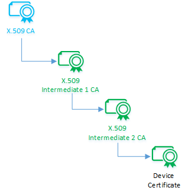
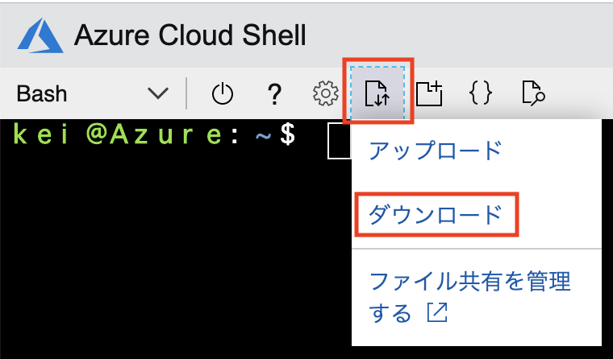
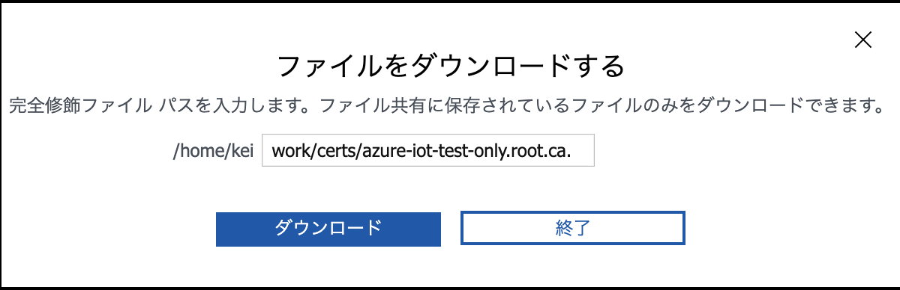
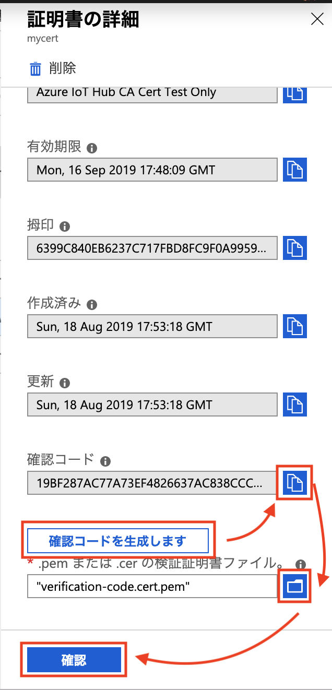

link:agenda.adoc[目次]

## 演習：IoTデバイスの証明書での認証

この演習では、IoT Hubに登録するルート証明書と、デバイスの認証に利用するリーフ証明書を作成します。
IoTデバイスに配布する証明書は、IoT Hubに登録した証明書から作成したチェーン証明書です。




### タスク1: 証明書の作成の準備

link:https://github.com/Azure/azure-iot-sdk-c/blob/master/tools/CACertificates/CACertificateOverview.md[] のツールを利用して、X.509の証明書を作成しIoT Hubに登録します。

. ブラウザで link:https://shell.azure.com[] にアクセスしてCloud Shellを開始します。

. azure-iot-sdk-c のリポジトリをクローンします。
+
```
git clone https://github.com/Azure/azure-iot-sdk-c
```

. 作業用ディレクトリを作成して、移動します。
+
```
mkdir work
cd work
```

. 必要なファイルをコピーします。
+
```
cp ~/azure-iot-sdk-c/tools/CACertificates/*.cnf .
cp ~/azure-iot-sdk-c/tools/CACertificates/*.sh .
```

. shell スクリプトに実行権限を付与します。
+
```
chmod 700 certGen.sh
```

### タスク2:証明書の作成とIoT Hubへの登録

. ルート証明書と証明書チェーンを作成します。
+
```
./certGen.sh create_root_and_intermediate
```
+
certsディレクトリとprivateディレクトリに証明書と鍵が作成されます。

* certs:
** azure-iot-test-only.chain.ca.cert.pem
** azure-iot-test-only.intermediate.cert.pem
** azure-iot-test-only.root.ca.cert.pem <- これがルート証明書

* private:
** azure-iot-test-only.intermediate.key.pem
** azure-iot-test-only.root.ca.key.pem

. Cloud Shell の上部のメニューでファイルダウンロード/アップロードアイコンをクリックし、プルダウンメニューでダウンロードをクリックします。
+


. ファイルダウンロードダイアログにルート証明書のファイルパスを入力し、[ダウンロード]をクリックします。
+
ファイルパス: work/certs/azure-iot-test-only.root.ca.cert.pem
+



. Azureポータル画面で本演習で利用するIoT Hubを選択します。

. 左Paneの設定セクションで[証明書]をクリックします。

. 右Pane上部の[+追加]をクリックします。

. 証明書の追加ダイアログで証明書の名前と証明書のファイルを指定します。
+
.基本の設定値と項目
[cols="2*", options="header"]
|===
|設定項目
|設定値

|証明書の名前
|任意の文字列

| .pem または .cer の証明書ファイル
|ファイルアイコンをクリックして、ダウンロードしたルート証明書を指定します。

|===

. 証明書の追加ダイアログ下部の[保存]をクリックします。
+
※アップロードした証明書の状態は *Unverified* となっています。

. IoT Hubの証明書の管理画面で、アップロードしたルート証明書をクリックします。

. 証明書の詳細ダイアログの下の方の確認コードフィールド下の[確認コードを生成します]をクリックします。
+


. 確認コードフィールドの右側のファイルアイコンをクリックして、確認コードをコピーします。

. Cloud Shellでルート証明書を確認用のCertファイルを作成します。
+
```
./certGen.sh create_verification_certificate [コピーした確認コード]
```

. Cloud Shell の上部のメニューでファイルダウンロード/アップロードアイコンをクリックし、プルダウンメニューでダウンロードをクリックします。

. ファイルダウンロードダイアログにルート証明書のファイルパスを入力し、[ダウンロード]をクリックします。
+
ファイルパス: work/certs/verification-code.cert.pem

. Azureポータル画面に戻り、証明書の詳細ダイアログの下の方の ".pem または .cer の検証証明書ファイル" フィールド右側のファイルアイコンをクリックします。

. ダウンロードした確認用ファイル (verification-code.cert.pem) を指定します。

. 証明書の詳細ダイアログ下部の[確認]をクリックします。

. 証明書の一覧に表示された状態が *Verified* になったことを確認します。
+
※自動的に更新されない場合は、画面上部の[最新の情報に更新]をクリックしてください。


### タスク3: デバイス用の証明書の作成

. Cloud Shellでデバイス用の証明書を作成します。
+
※ *mydevice* は、IoT Hubに登録するデバイス名です。デバイス名が異なる場合は読み替えてください。
+
```
./certGen.sh create_device_certificate mydevice
```
+
certs ディレクトリに new-device* というファイルが作成されます。

. Cloud Shellでデバイスの認証に利用するチェーン証明書を作成します。
+
```
cd ./certs && cat new-device.cert.pem azure-iot-test-only.intermediate.cert.pem azure-iot-test-only.root.ca.cert.pem > new-device-full-chain.cert.pem
```

. デバイスで利用する証明書ファイルをアーカイブにまとめて、デバイス用仮想マシンにコピーします。
+
```
cd ~/work
zip files.zip certs/new-device-full-chain.cert.pem certs/new-device.cert.pem private/new-device.key.pem
scp files.zip myadmin@[デバイスのIPアドレス]:/tmp/files.zip
```

### タスク4: IoT Hubへのデバイスの登録

証明書認証をするデバイスをIoT Hubに登録します。

. Azure管理画面で、本演習で利用するIoT Hubを選択します。

. IoT Hub設定画面の左Paneのエクスプローラセクションの[IoTデバイス]をクリックします。

. 右Pane上部の[+新規作成]をクリックしてデバイスの登録を開始します。

. デバイスの作成ダイアログで必要な項目を入力してデバイスを登録します。
+
.基本の設定値と項目
[cols="2*", options="header"]
|===
|設定項目
|設定値

|デバイスID
|mydevice  (デバイス用証明書を作成した時に指定したデバイス名)

|証明書の種類
|X.509 CA 署名済み

|このデバイスをIoTハブに接続する
|有効

|===

. デバイスの作成ダイアログ下部の[保存]をクリックします。

### タスク5: デバイスのアプリケーションの作成

証明書認証でデバイスがIoT Hubに接続する場合は、安全な接続を確立後、デバイスの認証を行います。

IoT Hubのクライアントに設定するオプションは次の通りです。

[cols="3*", options="header"]
|===

|オプション
|オプション名
|説明

|接続文字列
|-
|"HostName=<host_name>;DeviceId=<device_id>;x509=true" +
※device_idを利用するデバイスIDに変更

|Azureのサーバ証明書
|TrustedCerts
|タスク3で作成した "new-device-full-chain.cert.pem"

|X509証明書
|x509certificate
|デバイスの認証に利用する証明書

|X509キー
|x509privatekey
|デバイスの認証に利用するキー

|===


. ブラウザで https://shell.azure.com にアクセスしてCloud Shellを開始します。

. SSH でデバイス用の仮想マシンにログインします。

. サンプルプログラムを準備します。

.. サンプルプログラムをクローンしていない場合
+
azure-iot-samples-python をクローンします。
+
```
git clone https://github.com/Azure-Samples/azure-iot-samples-python
```

.. サンプルプログラムをクローン済みの場合
+
サンプルプログラムをコピーします。
+
```
cd ~
cp ~/azure-iot-samples-python/iot-hub/Quickstarts/simulated-device-2/SimulatedDevice.py X509Device.py
```

. サンプルプログラムの変更方法を確認します。
+
接続文字列の定義は、SASトークンの場合と異なり、IoT Hubのホスト名、デバイスID、x509認証であることをキーとバリューで設定します。
+
```
# String containing Hostname, Device Id in the format:
# "HostName=<host_name>;DeviceId=<device_id>;x509=true"

# Path to the trusted root CA certificate
CONNECTION_STRING = "HostName=satohub.azure-devices.net;DeviceId=mydevice;x509=true"
```
+
タスク3で作成した証明書ファイルをAzure IoT Hubに接続するための証明書、デバイス認証をするための証明書とキーとして指定します。
+
```
TRUSTED_ROOT_CA_CERTIFICATE_PATH = "/home/myadmin/work/certs/new-device-full-chain.cert.pem"
TRUSTED_DEVICE_CA_CERTIFICATE_PATH = "/home/myadmin/work/certs/new-device.cert.pem"

TRUSTED_DEVICE_CA_KEY_PATH = "/home/myadmin/work/private/new-device.key.pem"
```
+
証明書をIoT Clientに設定します。
+
```
# Set Certificate to the Client
def set_certificates(client):
    if len(TRUSTED_ROOT_CA_CERTIFICATE_PATH) > 0:
        cert_data = ''
        with open(TRUSTED_ROOT_CA_CERTIFICATE_PATH, 'rb') as cert_file:
            cert_data = cert_file.read()
        try:
            client.set_option("TrustedCerts", cert_data)
            print ( "set_option TrustedCerts successful" )
        except IoTHubClientError as iothub_client_error:
            print ( "set_option TrustedCerts failed (%s)" % iothub_client_error )
            sys.exit(1)

    if len(TRUSTED_DEVICE_CA_CERTIFICATE_PATH) > 0:
        dcert_data = ''
        with open(TRUSTED_DEVICE_CA_CERTIFICATE_PATH, 'rb') as dcert_file:
            dcert_data = dcert_file.read()
        try:
            client.set_option("x509certificate", dcert_data)
        except IoTHubClientError as iothub_client_error:
            print ( "set_option TrustedCerts failed (%s)" % iothub_client_error )
            sys.exit(1)


    if len(TRUSTED_DEVICE_CA_CERTIFICATE_PATH) > 0:
        key_data = ''
        with open(TRUSTED_DEVICE_CA_KEY_PATH, 'rb') as key_file:
            key_data = key_file.read()
        try:
            client.set_option("x509privatekey", key_data)
        except IoTHubClientError as iothub_client_error:
            print ( "set_option TrustedCerts failed (%s)" % iothub_client_error )
            sys.exit(1)
```
+
IoT Hub Clientインスタンスの初期化後、オプションを指定します。
+
```
def iothub_client_init():
    # Create an IoT Hub client
    client = IoTHubClient(CONNECTION_STRING, PROTOCOL)
    set_certificates(client)
    return client
```

### タスク6: X509認証のクライアントを実行

プログラムの変更が完了したら、プログラムを実行します。

```
python X509Device.py
```

link:agenda.adoc[目次]
