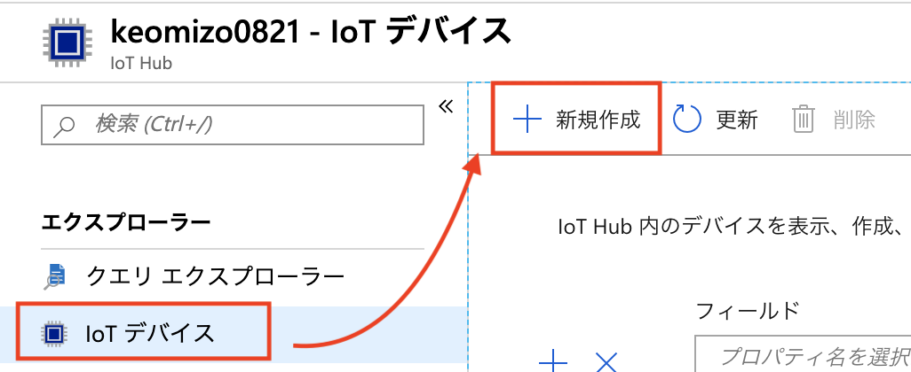
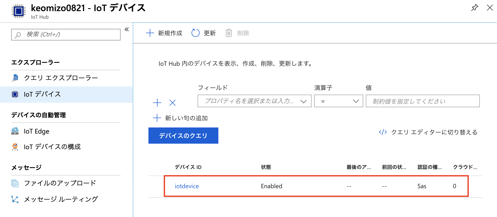
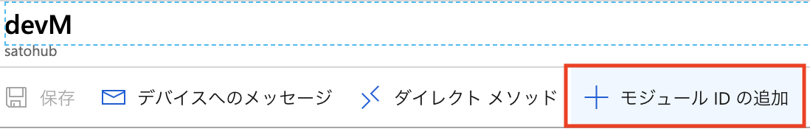

link:agenda.adoc[目次]

## 演習: モジュールツインの利用

### タスク1: デバイスとモジュールの登録

このタスクでは、Azure IoT Hubにデバイスとモジュールを登録します。

. Azureポータル画面で本演習で利用するIoT Hubを選択します。

. IoT Hubの左Paneのメニューのエクスプローラーセクションの[IoTデバイス]をクリックします。

. 右Pane上部の[+追加]をクリックします。
+


. デバイスの作成画面でパラメータを入力してデバイスを登録します。
+
.設定項目と設定値
[cols="2*", options="header"]
|===
|設定項目
|設定値

|デバイス ID
|例）_devM_ +
※任意のIdを設定可能

|認証の種類
|対称キー (デフォルトのまま)

|主キー, セカンダリキー
|（自動生成）

|自動生成キー
| チェック（デフォルトのまま）

|このデバイスをIoTハブに接続する
|有効 （デフォルトのまま）

|親デバイス（プレビュー）
|（デフォルトのまま）

|===

. [保存]をクリックします。

. デバイス一覧に追加したデバイスが表示されていることを確認します。
+
※表示されない場合は右Pane上部の[最新の情報に更新]をクリックしてください。
+


. デバイス一覧から、作成したデバイスを選択します。

. デバイスの詳細画面上部の[＋モジュールIDの追加]をクリックします。
+


. モジュールIDの追加ダイアログでパラメータを入力して、モジュールIDを登録します。
+
.設定項目と設定値
[cols="2*", options="header"]
|===
|設定項目
|設定値

|モジュールID名
|例）_mod1_ +
※任意のIdを設定可能

|認証の種類
|対称キー (デフォルトのまま)

|主キー, セカンダリキー
|（自動生成）

|自動生成キー
| チェック（デフォルトのまま）

|===

. モジュールIDの追加ダイアログ下部の[保存]をクリックします。


タスク3: サンプルアプリケーションの準備

. ブラウザで https://shell.azure.com にアクセスして Cloud Shell を開始します。

. デバイス用の仮想マシンに SSH でログインします。

. サンプルプログラムを準備します。

.. サンプルプログラムをクローンしていない場合
+
azure-iot-samples-python をクローンします。
+
*デバイスVM*
+
```
git clone https://github.com/Azure-Samples/azure-iot-samples-python
```

.. サンプルプログラムをクローン済みの場合
+
サンプルプログラムをコピーします。
+
*デバイスVM*
+
```
cd ~
cp ~/azure-iot-samples-python/iot-hub/Quickstarts/simulated-device-2/SimulatedDevice.py DeviceModule.py
```

. Azureポータル画面で本演習で利用するIoT Hubを選択します。

. IoTデバイス一覧からデバイス(例. __devM__)を選択し、デバイスの詳細画面でモジュールID(例. __mod1__)を選択します。

. 接続文字列をコピーします。

. 仮想マシンのエディタで Module.py を編集します。
+
*デバイスVM*
+
```
nano DeviceModule.py
```

. 矢印キーで下に進み、IoT Hubへに接続できるように、サンプルプログラムの接続文字列の定義（19行
目あたり）をコピーした接続文字列で置き換えます。
+
変更前
+
```
CONNECTION_STRING = "{Your IoT hub device connection string}"
```
+
変更後の例
+
```
CONNECTION_STRING = "HostName=iothub1234.azure-devices.net;DeviceId=devM;ModuleId=mod1;SharedAccessKey=I+Ps4mG7jqBASsIgbSpVJjxPbfpHzrxHHCb4BLcf0AU="
```

. 編集が終わったら、Ctrl-X を入力後、上書き確認で Y を入力します。

. サンプルアプリケーションを実行します。
+
*デバイスVM*
+
```
python DeviceModule.py
```

link:agenda.adoc[目次]
