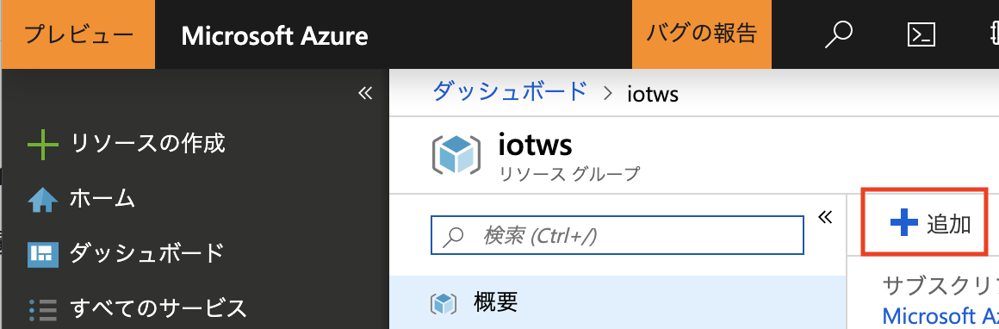

link:agenda.adoc[目次]

## 演習: Time Series Insightsによるデータの可視化

この演習では、IoT Hubで受信したデータをTime Series Insightsで表示します。

[NOTE]
====
Time Series Insightsの詳細は下記URLに記載があります。

https://docs.microsoft.com/ja-jp/azure/time-series-insights/time-series-insights-overview
====

Time Series Insights は時系列データを念頭に設計されたデータベースです。ほぼリアルタイムでのデータ探索が可能です。またTime Series Insights REST API を使用して新しいカスタム ソリューションを作成することもできます。既定のリテンション期間は31日間となっており、最大400日のデータ リテンション期間を構成できます。

### タスク1: IoT Hubにコンシューマーグループの作成

このタスクでは、IoT HubにTimeseries Insights用のコンシューマーグループを追加します。

. Azureポータル画面で本演習で利用するIoT Hubを選択します。

. IoT Hubの左Paneのメニューの設定セクションにある[組み込みのエンドポイント]をクリックします。

. コンシューマーグループに `tsi` と入力し、自動保存されるまで待ちます。 +
※自動保存が始まらない場合は、他のフィールドにフォーカスを移動してください。

### タスク2：Time Series Insightsの作成

このタスクでは、Azure上にTime Series Insightsを作成します。

. 本演習で利用するリソースグループ（例. _iotws_）を選択します。

. 右Pane上部の[+追加]をクリックします。
+


. 検索フィールドで `Time Series Insights` と入力しリターンを入力します。

. 検索結果の一覧の[Time Series Insights]をクリックします。

. 表示された詳細ウィンドウの[作成]をクリックします。

. Time Series Insights環境の作成ウィザードで設定値を入力後、ウィンドウ下部にある[作成]をクリックします。

. 基本のパラメータを入力します。
+
.基本の設定項目と設定値
[cols="2*", options="header"]
|===
|設定項目
|設定値

|環境名
|例）_iotwstsi_　（任意の文字列）

|サブスクリプション
|本演習で利用するAzureサブスクリプション

|リソースグループ
|例）_iotws_ +
本演習で利用するリソースグループを選択

|場所
|例）_米国東部_ +
※任意のリージョンが選択可能です

|層
|S1（デフォルトのまま）

|キャパシティ
|1（デフォルトのまま）

|===

. [次へ: イベントソース>>]をクリックして、イベントソースのパラメータを入力します。
+
.イベントソースの設定項目と設定値
[cols="2*", options="header"]
|===
|設定項目
|設定値

|イベントソースを作成しますか?
|いいえ

|===

. [確認と作成]をクリックします。

. 内容を確認して[作成]をクリックします。

. Azureポータル画面で本演習で利用するリソースグループ（例. _iotws_）から、作成したTimeseries Insightsを選択します。

. Timeseries Insightsの左Paneのメニューから環境トポロジセクションの[イベントソース]を選択します。

. 右Pane上部の[＋追加]をクリックします。

. 新しいイベントソースのダイアログでパラメータを入力します。
+
.設定項目と設定値
[cols="2*", options="header"]
|===
|設定項目
|設定値

|イベントソース名
|例）_iothub_

|ソース
|IoT Hub

|インポートオプション
|使用可能なサブスクリプションからIoT Hubを使用してください

|サブスクリプション
|本演習で利用するAzureサブスクリプション

|IoT Hub名
|本演習で利用する IoT Hub

|IoT Hubポリシー名
|iothubowner

|*IoT Hubコンシューマーグループ*
|*tsi*

|イベントシリアル化形式
|JSON

|タイムスタンプのプロパティ名
|（空白）

|===

. [作成]をクリックして、イベントソースを追加します。


#### タスク1 のワークアラウンド

[NOTE]
====
Azureポータル画面で[作成]をクリックしても何もおきない場合は、以下の方法でコマンドラインでデプロイしてください。

このワークアラウンドを実行する環境には、azure-cli と unzip コマンドが必要です。
====

. ファイルをダウンロード
+
*Cloud shell*
+
```
wget https://github.com/akubicharm/azure-workshop/raw/master/tool/tsi-deploy/tsideploy.zip
```

. ファイルを展開
+
*Cloud shell*
+
```
unzip tsideploy.unzip
```

. サブスクリプションの確認
+
*Cloud shell*
+
```
az account show
```
+
出力結果の id がサブスクリプションID
+
出力結果の例）
+
====
```
{
  "environmentName": "AzureCloud",
  "id": "00000000-0000-0000-0000-000000000000",
  "isDefault": true,
  "name": "Microsoft Azure XXX プラン",
  "state": "Enabled",
  "tenantId": "00000000-0000-0000-0000-000000000000",
  "user": {
    "name": "yournanme@example.com",
    "type": "user"
  }
}
````
====

. env ファイルの編集
+ SUBS に上記で確認したサブスクリプションIDと、RNAMEに本演習で利用するリソースグループ名を設定します。
+
*Cloud shell*
+
```
nano env
```
+
必要な内容を記載したら、`Ctrl-o` で内容を保存、`Ctrl-x` でエディタを終了します。

. 環境変数のセット
+
*Cloud shell*
+
```
. ./env
echo $SUBS
echo $RNAME
```
+
設定したサブスクリプションIDとリソースグループ名が出力されていればOKです。

. デプロイスクリプトの実行
+
*Cloud shell*
+
```
./deploy.sh -i $SUBS -g $RNAME -n $DNAME -l $LOC
```
+
スクリプトの実行結果の最後に次のコメントが出力されていることを確認します。
+
```
Template has been successfully deployed
```

### タスク 3：Time Series Insightsでのデータ表示とカスタマイズ

このタスクでは、作成したTime Series Insightsエクスプローラーへアクセスし、IoT Hubで受信した
温度データと湿度データを表示します。

. Azureポータル画面で本演習で利用するTime Series Insightsを選択します。

. 右Paneの[概要]ウィンドウ上部の[環境を開く]をクリックします。 +
※[Time Series Insights エクスプローラーのURL]がURLです。

. Time Series Insightsのポータル画面が表示されます。

. 温度データを表示するために左PaneのメニューのMEASUREプルダウンを[Events]から[temperature]に変更します。

. 湿度データを追加するために、サイドメニューの[Add]をクリックし、MEASUREプルダウンを[Events]から[humidity]に変更します。

. より詳細なデータを確認するために、表示期間を調整します。紫色の両端をドラッグアンドドロップし、範囲を調整します。Time Series Insightsエクスプローラーの左Paneのメニューからも範囲設定ができます。

. 左Paneのメニューの[Interval size]を設定すると、グラフの描画粒度を調整することができます。Interval sizeごと平均の値がグラフに描画されています。

. 表示するプロパティが１つの場合、ヒートマップを表示することができます。humidityのみ表示されるように、左Paneで[Only]をクリックして、Humidityのみ表示します。

. 右Paneの上部の[HEATMAP]を選択して、ヒートマップを表示します。

link:agenda.adoc[目次]
