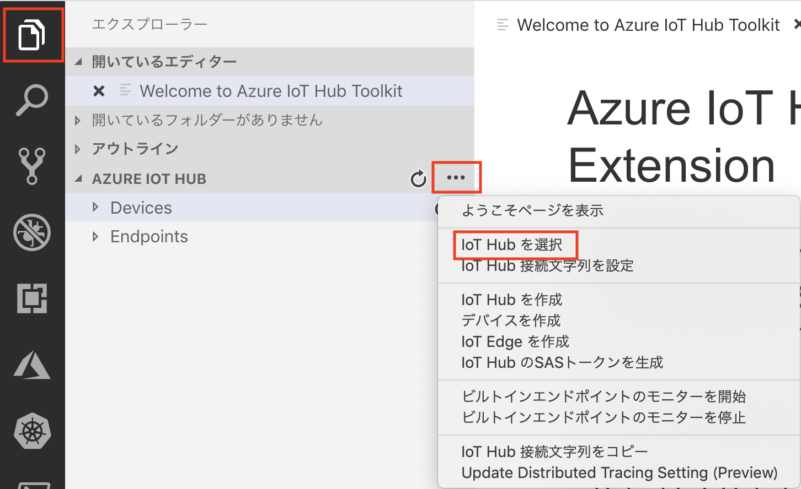
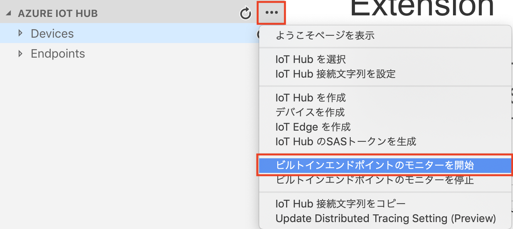
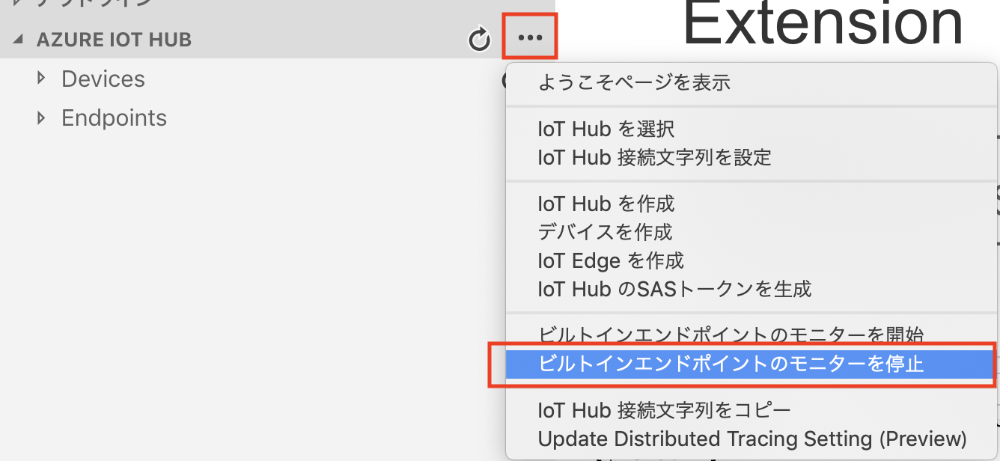

link:agenda.adoc[目次]

## 演習：VSCodeのAzure IoT Toolkit の利用

Visual Studio Code の Azure IoT Toolkit を利用して、device-to-cloudメッセージの確認などを行います。

https://docs.microsoft.com/ja-jp/azure/iot-hub/iot-hub-device-management-iot-toolkit


### タスク1: VSCode のインストール

. https://code.visualstudio.com/ にアクセスして、ご利用のプラットフォームにあったVSCodeをダウンロードします。

. インストールが完了したら、VSCode を起動します。

### タスク2: Azure IoT Toolsのインストール

. https://marketplace.visualstudio.com/items?itemName=vsciot-vscode.azure-iot-tools にアクセスして、Azure IoT Toolkit のプラグインをVSCodeにインストールします。


### タスク3: Azure IoT Hub にアクセス

. VSCodeのエクスプローラービューで、左下の[Azure IoT Hub]メニューをクリックし、右側の[...]をクリックします。
+
プルダウンメニューで、[IoT Hubを選択]をクリックします。
+


. サブスクリプションの一覧から本演習で利用するサブスクリプションを選択します。

. IoT Hubの一覧から本演習で利用するIoT Hubを選択します。デバイスの一覧が表示されるまで少し待ちます。

### タスク4: ビルトインエンドポイントのへのDevice-to-Cloudメッセージをモニター

. VSCodeのエクスプローラービューで、左下の[Azure IoT Hub]メニューをクリックし、右側の[...]をクリックします。

. [ビルトインエンドポイントモニターを開始]をクリックします。
+


. ブラウザで https://shell.azure.com にアクセスし、IoTデバイス用の仮想マシンにSSHでログインします。

. サンプルプログラムのディレクトリに移動します
+
*デバイスVM*
+
```
cd ~/azure-iot-samples-python/iot-hub/Quickstarts/simulated-device-2
```

. サンプルプログラムを実行します。
+
*デバイスVM*
+
```
python SimulatedDevice.py
```

. VSCode でメッセージをモニターします。

. VSCodeのエクスプローラービューで、左下の[Azure IoT Hub]メニューをクリックし、右側の[...]をクリックします。

. [ビルトインエンドポイントモニターを終了]をクリックしてモニターを終了します。
+



link:agenda.adoc[目次]
