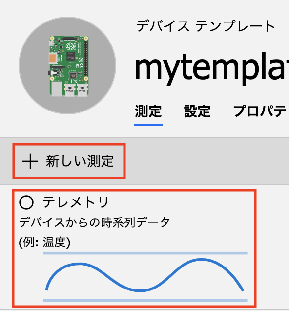

# 演習: IoT Centralのカスタマイズ

この演習では、IoT Central をカスタマイズし、ビューやデバイス操作をできるようにしていきます。

## タスク1: デバイステンプレートの作成

このタスクでは、デバイステンプレートを作成して、ビューやデバイスの操作をカスタマイズしていきます。

. 左Paneで[デバイステンプレート]をクリックします

. テンプレート一覧で[Raspberry Pi]のチェックボックスをチェックし、画面右上のコピーボタンをクリックします
+


. デバイステンプレートのコピーダイアログでテンプレート名を入力し[続行]ボタンをクリックします
+


## タスク2: 測定項目（テレメトリ）の編集

サンプルプログラムから送られてくる顔認識した数と温度を測定値として表示するようにデバイステンプレートのテレメトリの項目を変更します。

```
{"numOfFace": 1}
{"temperature": 5}
```

. デバイステンプレートの[測定]タブをクリックします

. テレメトリの[temperature]以外の測定項目の鉛筆アイコンをクリックして編集ビューを表示します

. 編集ビュー上部の[削除]ボタンをクリックして測定項目を削除します
+
image::images/iotc_devicetemplate_rmtelemetry.png[]

. デバイステンプレートの測定タブ上部の[+ 新しい測定]をクリックし、[テレメトリ]をクリックします
+


. テレメトリの測定項目のパラメータを入力します
+
.基本の設定項目と設定値
[cols="2*", options="header"]
|===
|設定項目
|設定値

|Display Name
|人数

|フィールド名
|numOfFace　（デバイスから送信されていくるフィールド名）

|===

## タスク3: 測定項目（状態）の編集

サンプルプログラム送られてくるデバイスの状態を表示するように、状態の測定項目を編集します。

デバイス送信されてくる deviceState は、 "Normal"、"Caution"、"Danger" のいずれかです。送信されてきた状態に応じて色分けして可視化します。

_デバイスからのメッセージ例_
```
{"devideState": "Normal"}
{"devideState": "Caution"}
{"devideState": "Danger"}
```

TODO: 図を挿入

. デバイステンプレートの[測定]タブをクリックします

. デバイステンプレートの測定タブ上部の[+ 新しい測定]をクリックし、[状態]をクリックします

. 状態の測定項目のパラメータを入力します
+
.基本の設定項目と設定値
[cols="2*", options="header"]
|===
|設定項目
|設定値

|DispayName
|状態

|フィールド名
|deviceState (デバイスから送信されるプロパティ名)

2+| *値の右の[+]をクリックして新しい値を追加します*

2+|

|値
|Normal

|表示名
|通常

|カラー
|水色（青信号っぽい色）


2+|

|値
|Caution

|表示名
|注意

|カラー
|黄色（黄色信号っぽい色）

2+|

|値
|Danger

|表示名
|危険

|カラー
|赤（赤信号っぽい色）

|===
