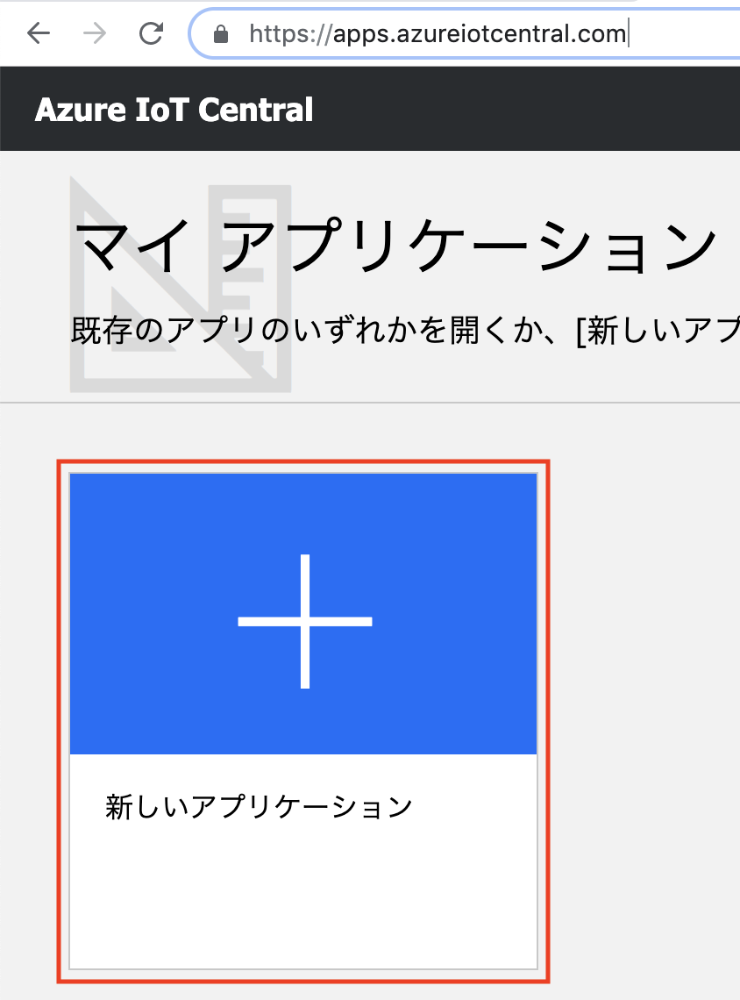
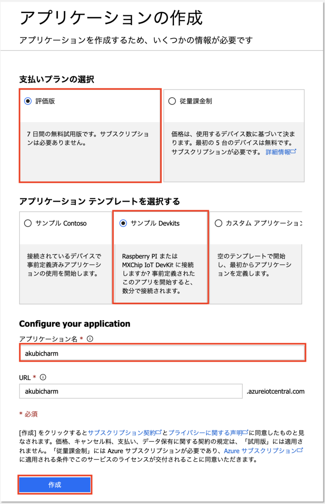
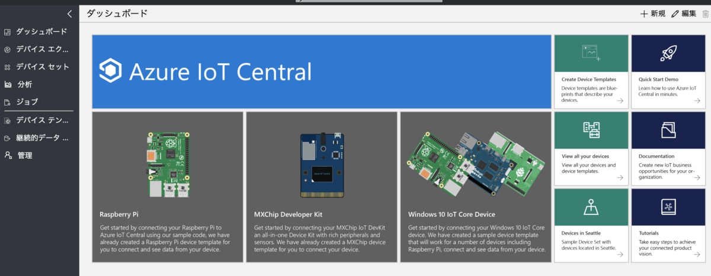

## 演習：IoT Centralのデプロイ

IoT Centralをデプロイします。

### タスク1: IoT Centralのポータルにアクセスします

このタスクでは、WebブラウザでIoT Centralのポータル画面にアクセスし、IoT Centralをデプロイします。

. ブザウザで IoT Centralのポータル画面にアクセスします。
+
https://apps.azureiotcentral.com/

. [新しいアプリケーション]をクリックします。
+

. アプリケーションの作成画面で、アプリケーションの作成情報を入力し[作成]ボタンをクリックします。
+

+
.基本の設定項目と設定値
[cols="2*", options="header"]
|===
|設定項目
|設定値

|支払いプランの選択
|評価版

|アプリケーションテンプレートを選択する
|サンプルDevkits

2+|*Configure your application*

|アプリケーション名
|適当な名称

|URL
|一意になるURL

2+|Contact information

|First Name
|名

|Last Name
|姓

|Email
|メールアドレス

|Phone number
|電話番号

|Country/Region
|国を選択

|プライバシーステートメントのチェックボックス
|チェック

|===

. [作成]をクリックして、IoT Centralのデプロイを開始します

5分くらいでデプロイが完了して、ダッシュボードが表示可能になります。

