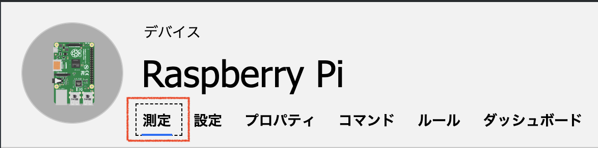
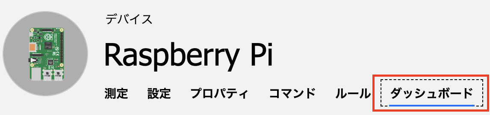

## 演習: IoT CentralのUIの操作

IoT Central では、デバイス管理やテレメトリデータの可視化のビューがすでに用意されています。

##### デバイステンプレート
各種デバイスの動作や機能、また、可視化のためのビューを定義します。

* Measutements（測定）：デバイスがIoT Centralに送信するテレメトリを指定します。
* 設定：オペレータが設定できる構成を指定します。
* プロパティ：オペレータが設定できるメタデータを指定します。
* ルール：でエバ椅子から送信されたデータに基づいたIoT Centralの動作を定義します。
* ダッシュボード：デバイスのビューを定義します

##### デバイスセット
指定されたいくつかの条件にすべてが一致しているためにグループ化されたデバイスの一覧です。 デバイス セットは、デバイスをより小さい論理グループにグループ化することで、デバイスを大規模に管理、視覚化、および分析するのに役立ちます。

##### エクスプローラ
デバイステンプレートごとにデバイスを表示するビューです。

##### 分析
IoT Centralに接続されているデバイスの動作をわかりやすく示したグラフが表示されます。 オペレーターは、このページを使用して、接続されているデバイスの問題を監視したり調査したりします。分析の単位はデバイスセットです。

##### ジョブ
デバイスに対して一括のデバイス管理操作を実行できます。 一括で操作する単位は、デバイスセットです。

### タスク1: デバイスエクスプローラ

. 左Paneで[デバイスエクスプローラ]をクリックします

. テンプレート一覧から[Raspberry Pi(1.0.0)]をクリックし、表示されたデバイス一覧で本演習で追加したデバイスをクリックします

. 右Paneの[測定]をクリックします
+

. テレメトリの表示方法を変更します
+

+
.. 歯車マークをクリックすると、グラフ表示する値の集合関数を選択できます
.. 目マークをクリックすると、グラフ表示のオン/オフを切り替えます

. 右Paneの[ダッシュボード]をクリックします
+

### タスク2: 分析

. 左Paneで[分析]をクリックします

. 右Paneのデバイスセットのプルダウンメニューで[Raspberry Pi(1.0.0)]を選択し、画面下部の[結果の表示]をクリックします
+

. 右Paneの[分割基準]のプルダウンで[Device ID]を選択して、デバイス単位でのグラフ表示に変更します
