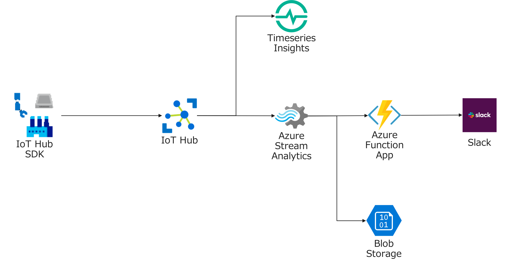

## Azure IoT ハンズオン - クラウドからリアルタイムな異常検知

## 目的
Azure IoTと関連するサービスを利用して、テレメトリデータの異常検知と通知を行うアプリケーションの開発を体験していきます。

このワークショップでは、Azure Function Appを利用して外部サービスとの連携など、現実的な利用に即した仕組みを構築します。

IoT Deviceのアプリケーションは、Azure IoT Device SDK(Python)を利用したサンプルプログラムを、Azure Function Appは C#Scriptを利用したサンプルプログラムを利用します。
Azure DevOpsのリポジトリの編集機能を利用して、アプリケーションの編集、Azure DevOpsのパイプラインを利用したAzure Function Appのデプロイを行います。

## 対象
Azure IoTを利用したサービスの設計や開発に興味のある人。

## 利用するサービス

* Azure IoT Hub
* Azure Stream Analytics
* Azure Function Apps
* Azure DevOps
* Linux VM

## 実習に必要な環境
* AzureのSubscription
* Azureポータル、Azure DevOpsポータルが利用可能なブラウザ

## 目次

. Azure環境の準備 link:prepare_azure.adoc[]
+
本演習で利用するAzureのリソースグループの作成、Azure DevOpsのユーザ登録などを行います。

. IoT Deviceアプリケーションの開発 link:iot_device_app.adoc[]
+
IoT HubのデプロイおよびIoT DeviceでのサンプルアプリケーションとIoT Hubの接続を行います。

. Timeseries Insightsでの可視化 link:timeseries_insights.adoc[]
+
IoTデバイスから送信されたテレメトリデータの可視化を行います。

. Function Appの作成 link:function_send_msg_to_slack.adoc[]
+
温度の急上昇や急降下があった場合にリアルタイムにSlackにメッセージを送信するためのAzure Function Appを作成します。このFunctionは、Azure Stream Analyticsでのストリーム処理から呼び出されます。

. Azure Stream Analyticsでの異常検知の処理 link:asa_on_cloud_anomaly_detection.adoc[]
+
Azure Stream Analyticsの異常検知の機能利用して、温度の急上昇と急降下を検知してリアルタイムに通知する仕組みを実装します。
