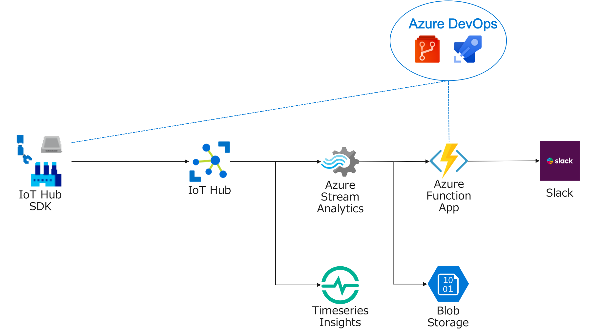

# Azure IoT ハンズオン - クラウドからリアルタイムな異常検知

## 目的
Azure IoTと関連するサービスを利用して、テレメトリデータの異常検知と通知を行うアプリケーションの開発を体験していきます。

このワークショップでは、Azure Function Appを利用して外部サービスとの連携など、現実的な利用に即した仕組みを構築します。

## 対象
アプリケーション開発経験のある人

## 利用するサービス

* Azure IoT Hub
* Azure Stream Analytics
* Azure Function Apps
* Azure DevOps
* Linux VM

## 目次

. Azure環境の準備 link:prepare_azure.adoc[]
. IoT Deviceアプリケーションの開発 link:iot_device_app.adoc[]
. Timeseries Insightsでの可視化 link:timeseries_insights.aodc[]
. Function Appの作成 link:function_send_msg_to_slack.adoc[]
. Azure Stream Analyticsでの異常検知の処理 link:asa_on_cloud_anomaly_detection.adoc[]
