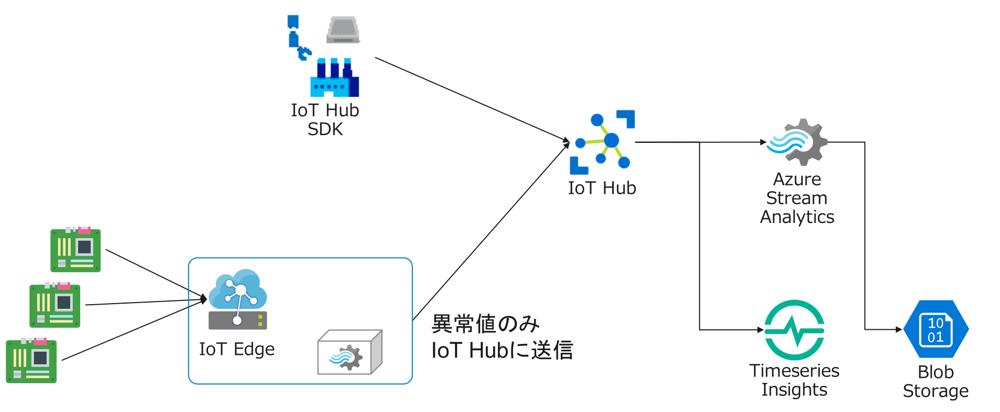

## Azure IoT ハンズオン - Edgeでリアルタイムな異常検知

## 目的
Azure IoTと関連するサービスを利用して、テレメトリデータの異常検知と通知を行うアプリケーションの開発を体験していきます。
このハンズオンでは、リーフデバイス → IoT Edge → Azure IoT Hub の連携を実現していきます。

IoT Deviceのアプリケーションは、Azure IoT Device SDK(Python)を利用したサンプルプログラムを利用します。

## 対象
Azure IoTを利用したサービスの設計や開発に興味のある人。

## 利用するサービス

* Azure IoT Hub
* Azure IoT Edge
* Azure Stream Analytics on Edge
* Azure Timeseries Insights
* Azure Blob Storage
* Linux VM

## 実習に必要な環境
* AzureのSubscription
* Azureポータルが利用可能なブラウザ

## 目次

. Azure環境の準備 link:prepare_azure.adoc[]
+
本演習で利用するAzureのリソースグループの作成、Azure DevOpsのユーザ登録などを行います。

. IoT Deviceアプリケーションの開発 link:iot_device_app.adoc[]
+
IoT HubのデプロイおよびIoT DeviceでのサンプルアプリケーションとIoT Hubの接続を行います。

. Timeseries Insightsでの可視化 link:timeseries_insights.aodc[]
+
IoTデバイスから送信されたテレメトリデータの可視化を行います。

. Azure Stream Analytics on Edgeでの異常検知の処理 link:iot_edge_deploy.adoc[]
+
Azure Stream Analyticsの異常検知の機能利用して、温度の急上昇と急降下を検知してIoT に通知する仕組みを実装します。
