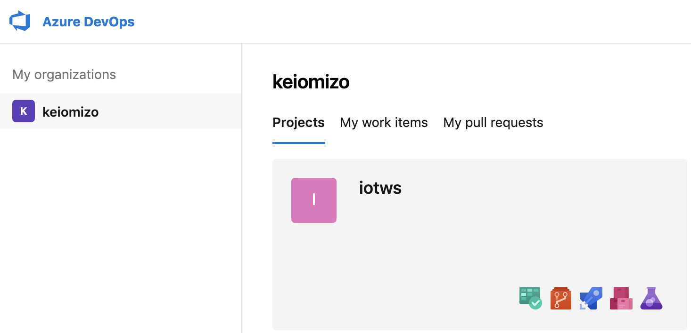
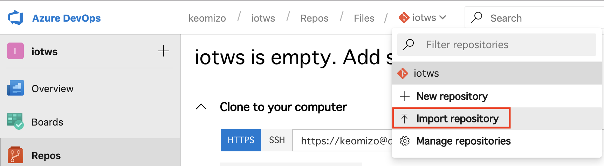

## 演習: Azure Functionを利用したSlackへのメッセージ送信

ここではAzure Stream Analyticsのアウトプットとして利用するSlackにメッセージを送信するAzure Function Appを作成します。


### タスク1: slackのワークスペースを作成する

このタスクでは、Function Appからのメッセージ送信先となるSlackのワークスペースを作成します。

. `https://slack.com/intl/ja-jp/create` にアクセスして、メールアドレスを入力してSlackのワークスペースを作成します。

. 登録したメールアドレスに送られてきた確認コード(6桁)を入力します。

. 社名またはチーム名を入力し[次へ]をクリックします
+
例）_iotws_

. プロジェクト名を入力し[次へ]をクリックします。（チャンネル名）
+
例）_workshop_
+
この名称が、Slack にメッセージを送信する対象のチャンネル名になります。

. チームメンバーは追加せず[後で]をクリックします。

. [Slackでチャンネルを表示する]をクリックします。


. Slackのワークスペースの左側のメニューで[App]をクリックします。

. アプリ一覧画面の検索フィールドに `Incoming webhook` と入力しします。

. 検索結果の一覧からIncoming Webhookの[インストール]をクリックします。
+


. Incoming Webhook設定ダイアログの[設定を追加]をクリックします。
+
image::images/slack_webhook_addconfig.png[]

. 設定画面でメッセージを送信するチャンネルを選択し、[Incoming Webhookインテグレーションの追加]をクリックします。
+
image::images/slack_webhook_addchannel.png[]

. Webhook URLをコピーします。
+
image::images/slack_webhook_copyurl.png[]

### タスク2: Azure Function Appの作成

このタスクでは、Slackにメッセージを送信するAzure Function Appを作成します。

. Azureポータル画面で本演習で利用するリソースグループ（例. _iotws_）を選択します。

. Azureポータル画面の右Pane上部の[+追加]をクリックします。

. 検索フィールドに `function app` と入力して、リターンを入力します。

. 検索結果の一覧から[Function App]を選択し、[作成]をクリックします。

. Function App作成用のパラメータを入力します。
+
.設定項目と設定値
[cols="2*", options="header"]
|===

|設定項目
|設定値

|アプリ名
|例）_func1234_ +
※ URLが一意となる文字列

|サブスクリプション
|本演習で利用するサブスクリプション

|リソースグループ
|既存のものを使用 +
本演習で利用するリソースグループを選択 （例. _iotws_）

|OS
|Windows

|ホスティングプラン
|従量課金プラン

|場所
|（例. _東日本_） +
※任意のリージョンが選択可能です。

|ランタイムスタック
|.NET

|Storage
|新規作成 +
※ わかりやすい名称にします

|===

. [作成]をクリックして、Function Appを作成します。
+
デプロイが完了するまで待ちます。


### タスク3: Functionアプリケーションのソースコードのインポート

このタスクでは、サンプルアプリケーションを各自のAzure DevOpsのソースコードリポジトリにインポートします。

. Azure DevOpsのポータル画面の左PaneでMy Organizationから本演習で利用する組織を選択します。
+


. 左Paneのメニューで[Repos]をクリックします。

. リポジトリのプルダウンメニューから[Import repository]を選択します。
+


. Import a Git repositoryのダイアログでパラメータを入力し、リポジトリをインポートします。
+
.設定値と項目
[cols="2*", options="header"]
|===

|設定値
|項目

|Source type
|Git

|Clond URL
|https://github.com/akubicharm/AzureFunction-callSlack

|name
|AzureFunction-callSlack

|===

. [import]をクリックして、リポジトリをインポートします。


### タスク4: Azure Functionアプリケーションの編集

. Azure DevOpsのポータルの左PaneのメニューでReposメニューの[Files]をクリックします。

. `HttpTriggerSlack/run.csx` をクリックしてソースコードを表示します。

. 左Paneの上部の[Edit]をクリックして編集を開始します。

. WEBHOOK_URL（26行目あたり）の定義をSlackのWebhook URLに変更します。

. [Commit]をクリックして変更を保存します。


### タスク5: Azure DevOpsのリリースパイプラインの作成

このタスクでは、Azure DevOpsのリリースパイプラインを作成して、Azure Functionにアプリケーションをデプロイします。

. Azure DevOpsのポータルの左PaneのメニューでPipelineメニューの[Releases]をクリックします。

. [New pipelines]をクリックしてパイプラインの作成を開始します。

. Select a Templateダイアログで[Deploy a Function app to Azure Function]をクリックします。
+


. PipelineのダイアログでArtifactをクリックして、Add an Artifactのダイアログを表示します。

. Add an Artifactのダイアログでパラメータを入力して、Artifactを追加します。
+

+
.設定項目と設定値
[cols="2*", options="header"]
|===

|設定項目
|設定値

|Source Type
|Azure Repository

|Project
|本ワークショップ用に作成したAzure DevOpsのプロジェクト
+例）__iotws__

|Source(repository)
|AzureFunction-callSlack

|Default branch
|master

|Default version
|Latest fron the default branch (デフォルトのまま）

|Shallow fetch depth
|（空白のまま）

|Source alias
|_AzureFunction-callSlack（デフォルトのまま）

|===

. [Add]をクリックします。

. Stage1の[1 job, 1 task]のリンクをクリックしてJob, Taskの編集を開始します。
+


. Stage1を編集します。
+

+
.設定項目と設定値
[cols="2*", options="header"]
|===

|設定項目
|設定値

|Stage Name
|Stage 1

|Azure Subscription
|本演習で利用するサブスクリプション

|App type
|Function App on Windows

|App Service name
|前のタスクで作成したFunctionの名称

|===

. Deploy Azure Function App をクリックします。

. Package or folder の入力フィールドの右の[...]をクリックしてダイアログを表示します。

. Select a file or folder のダイアログで[Azure Function callSlack]を選択し[OK]をクリックします。
+
image::images/devops_edit_deployfunc.png[]

. 画面上部の[save]をクリックし、表示されたダイアログで[OK]をクリックします。

. 画面上部の[Cleate release]をクリックしてリリースパイプラインを実行します。


////

. Azureポータル画面で、本演習で利用するリソースグループを選択します。

. Azureポータル画面の右Paneで、作成したFunction Appsをクリックします。

. 右Pane上部の[プラットフォーム機能]をクリックしてメニューを表示し、[デプロイセンター]をクリックします。
+


. Deployment Centerウィザードの *1. ソース管理* で、[Azure Repos]を選択し[続行]をクリックします。

. Deployment Centerウィザードの *2. ビルドプロバイダー* で[Azure Pipelines]を選択し、[続行]をクリックします。

. Deployment Centerウィザードの *3. 構成* でパラメータを入力し[続行]をクリックします。
+
.設定項目と設定値
[cols="2*", options="header"]
|===

|設定項目
|設定値

|Azure DevOps Organization
|（Azure DevOpsを利用するユーザ名）

|プロジェクト
|本演習で利用する Azure DevOpsプロジェクトを選択します。 +
（例. _iotws_）

|リポジトリ
|AzureFunction-callSlack

|ブランチ
|master

|Function App type
|スクリプト Function App

|作業ディレクトリ
|app

|===
+
[続行] をクリックします。

. Deployment Centerウィザード　*4. ステージングにデプロイする* でパラメータを入力し[続行]をクリックします。
+
.設定項目と設定値
[cols="2*", options="header"]
|===

|項目
|設定値

|デプロイスロットを有効にする
|いいえ

|===

. Deployment Centerウィザード *5. 概要* で内容を確認し[完了]をクリックします。

. Azure DepOpsポータルで、ビルド・デプロイが始まっていることを確認し、完了するまで待ちます。
+
アイコンがぐるぐる回っている間はビルド中です。
+
Pipelines -> Builds
+

+
Pipelines -> Releases
+

+
ビルドデプロイ完了すると、Stageに緑色のチェックになります。

////

### タスク6: Azure Functionの動作確認

このタスクでは、作成したFunctionの動作確認をAzureポータル画面で行います。

. Azureポータル画面で本演習で利用するリソースグループを選択します。

. 作成したFunction Appを選択します。

. 左Paneで[関数（読み取り専用） -> HttpTriggerSlack]をクリックします。

. 右端の縦長のタブメニューの[テスト]をクリックします。
+
image::images/func_testtab.png[]

. Request bodyのテキストエリアにPOSTするリクエストを記載し、画面右下の[>実行]をクリックします。
+
```
[
    {
        "time": "2019-03-13T11:14",
        "temp": 30
    }
]
```
+
image::images/func_run.png[]

. ブラウザでSlacちゃチャンネルを表示して、メッセージが送信されていることを確認します。
+

