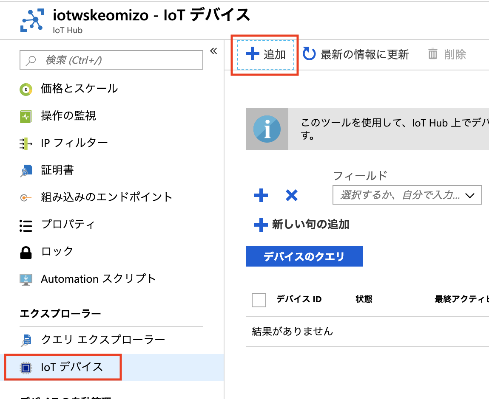
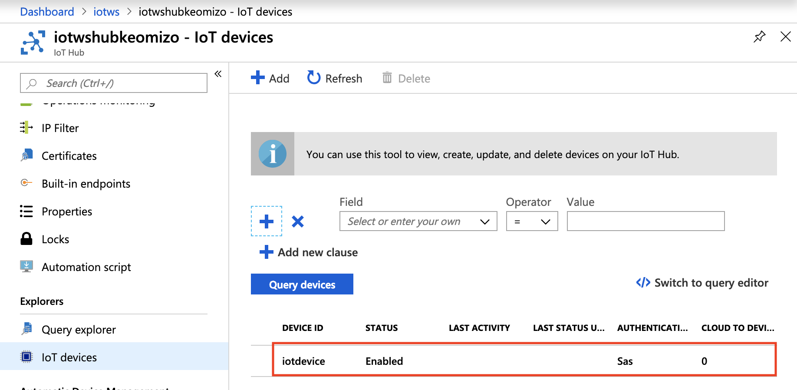

## 演習：IoT Device サンプルアプリケーションの実行

### タスク1: IoT Hubの作成

このタスクでは、本演習で利用するリソースグループにIoT Hubを作成します。

. 本演習で利用するリソースグループ（例. _iotws_）を選択します。
. 画面上部の[+追加]をクリックします。

. 検索フィールドに `IoT Hub` と入力します。

. 検索結果の一覧から[IoT Hub]を選択し、右側に表示されたPaneの左下の[作成]をクリックします。

. 必要なパラメータを入力していきます。
+
.Basicの設定値と項目
[cols="2*", options="header"]
|===
|設定項目
|設定値

|サブスクリプション
|本演習で利用するAzureサブスクリプション

|リソースグループ
|例）_iotws_ +
本演習で利用するリソースグループを選択します

|リージョン
|例）東日本 +
※任意のリージョンを選択します

|IoT Hub名
|例）_iothub1234_ +
任意の名称を設定します。 +
一意の名称にする必要があります

|===

. [次へ: サイズとスケール>>]をクリックします。

. Size and Scaleのパラメータを入力します。
+
.Size and scaleの設定項目と瀬低地
[cols="2*", options="header"]
|===
|設定項目
|設定値

|価格とスケールティア
|F1:Free レベル

|IoT Hub F1のユニット数
|1 （デフォルトのまま）

|詳細設定. Device-tocloudパーティション
|1 （デフォルトのまま）

|===

. [確認および作成]をクリックして内容を確認し、[作成]をクリックします。


### タスク2: IoT Hubへのデバイス登録

このタスクでは、IoT Hubにテレメトリデータを送信するデバイスを新規登録します。IoT Hub上でデバイスを新規登録し、デバイスIDとデバイスキー（認証キー）を発行します。

[NOTE]
====
デバイスがIoT Hubにデータを送信するためには、事前にIoT Hubにデバイスを登録しておく必要があります。
====

. Azureポータル画面で本演習で利用するIoT Hubを選択します。

. IoT Hubのメニューのエクスプローラーのセクションの[IoTデバイス]をクリックします。

. ウィンドウ上部の[+Add]をクリックします。
+


. [デバイスの作成]画面パラメータを入力してデバイスを登録します。
+
.設定項目と設定値
[cols="2*", options="header"]
|===
|設定項目
|設定値

|デバイス ID
|例）_iotdevice_ +
※任意のIdを設定可能

|認証の種類
|Symmetric key (デフォルトのまま)

|主キー, セカンダリキー
|（自動生成）

|自動生成キー
| チェック（デフォルトのまま）

|このデバイスをIoTハブに接続する
|有効 （デフォルトのまま）

|親デバイス（プレビュー）
|（デフォルトのまま）

|===

. [保存]をクリックします。

. デバイス一覧に追加したデバイスが表示されていることを確認します。
+


### タスク2: IoT Device用仮想マシンの準備

このタスクでは、IoTデバイスとして利用する仮想マシンを作成します。本演習では、Ubuntu 16.04 を利用します。

※Pythonから利用するライブラリのバージョンの関係で、16.04を利用します。

. リソースグループの一覧から本演習で利用するリソースグループ （例. _iotws_） を選択します。

. 画面上部の[+Add]をクリックし検索ウィンドウで `ubuntu` と入力しリターンキーを押します

. 検索結果の一覧から[Ubuntu Server 18.04 LTS]を選択して[作成]をクリックします。
+


. 仮想マシン作成のパラメータを設定します。
+
.Basicの設定項目と設定値
[cols="2*", options="header"]
|===
|設定項目
|設定値

|サブスクリプション
|本演習で利用するサブスクリプションを選択

|リソースグループ
|例）_iotws_ （本演習で利用するリソースグループを選択）

|仮想マシン名
|例)_iotdevicevm_　（任意のマシン名）

|地域
|東日本

|可用性オプション
|No infrastructured redundancy required （デフォルトのまま）

|イメージ
|*Ubuntu Server 16.04 LTS* +
※ここで 16.04のイメージを指定します。

|サイズ
|Standard D2sv3　（デフォルトのまま）

|認証の種類
|パスワード

|ユーザー名
|例）_myadmin_ （任意のユーザ名）

|パスワード
|例）_#myadmin1234_ （任意の文字列 12文字以上、記号を含む）

|パスワードの買う人
|上記と同じ文字列

|Azure Active Directoryでログインする（プレビュー）
|オフ

|パブリク受信ポート
|選択したポートを許可する

|受信ポートを選択
|SSH(22)

|===

. [次へ: ディスク>]をクリックします。

. ディスクのパラメータを入力します。
+
.ディスクの設定項目と設定値
[cols="2*", options="header"]
|===
|設定項目
|設定値

|OS ディスクの種類
|Standard SSD

|===

. [確認および作成]をクリックします。
+
※Networking, Management, Advanced, Tags はデフォルトのまま変更なしなので、設定はスキップします。

. レビューが完了したら[作成]をクリックして仮想マシンを作成します。

### タスク3: IoTデバイスの環境設定

このタスクでは作成した仮想マシンに IoT Device SDKなどの設定をします。

[NOTE]
====
詳細はマニュアルを参照
https://docs.microsoft.com/ja-jp/azure/iot-hub/quickstart-send-telemetry-python
====

. クラウドシェルをBashモードで実行します。

. 作成した仮想マシンを選択し、画面上部の[接続]をクリックします。

. "VM ローカルアカウントを使用してログインする"のフィールドに記載されているSSHコマンドの文字列をコピーします。

. コピーした文字列をクラウドシェルのBashターミナルに貼り付けて、仮想マシンにSSHでログインします。

. "Are you sure you want to continue connecting (yes/no)?" と表示されるたら、`yes` を入力しリターンを入力します。

. パスワード（例._#myadmin1234_）を入力します。

. sudo コマンドで root ユーザにスイッチします。
+
```
sudo -i
```

. Azure IoT SDKの準備をします。
+
```
apt -y update
apt -y upgrade
apt -y install libboost-all-dev
apt -y install libcurl4-nss-dev
apt -y install libcurl4-openssl-dev
apt -y install python-pip unzip
```

. myadminユーザに戻ります。
+
```
exit
```

### タスク4: サンプルアプリケーションの準備

Azure DevOpsのソースコードリポジトリに、IoTデバイスのサンプルアプリケーション用のリポジトリを準備します。

. Azure DevOpsにログインします。

. 本演習で利用するプロジェクト（例. _iotws_）を選択します。
+
image::images/devops_org.png[]

. 左側のメニューで[Repos]をクリックします。

. リポジトリのプルダウンメニューから[Import repository]を選択します。
+
image::images/devops_import.png[]

. Gitリポジトリのインポートダイアログに必要なパラメータを入力します。
+
.設定項目と設定値
[cols="2*", options="header"]
|===

|設定項目
|設定値

|Source Type
| Git

|Clone URL
|https://github.com/Azure-Samples/azure-iot-samples-python

|Name
|azure-iot-samples-python

|===

. [import]をクリックし、importが完了するまで待ちます。


. Azureポータル画面で本演習で利用するIoT Hubを選択し、IoTデバイス一覧から追加したIoTデバイスを選択し、接続文字列をコピーします。
+
image::images/iothub_iotdevice_connstr.png[]

. Azure DevOpsのポータルで _azure-iot-samples-python_ 表示し、`iot-hub/Quickstarts/simulated-device-2/SimulatedDevice.py` を開きます。

. 右側のPaneの[Edit]をクリックし、ソースコードの編集を開始します。


. IoT Hubへに接続できるように、サンプルプログラムの接続文字列の定義（19行目あたり）をコピーした接続文字列で置き換えます。
+
変更前
+
```
CONNECTION_STRING = "{Your IoT hub device connection string}"
```
+
変更後の例
+
```
CONNECTION_STRING = "HostName=iotwshub1234.azure-devices.net;DeviceId=iotdevice;SharedAccessKey=kbpVCJXfY01hCuJ6HpijkBC6lL+0pi2fa8e0/VXfKLY="
```

. 温度を乱数で設定している部分(73行目あたり）を編集して、急上昇や急降下が発生するように変更します。
+
変更前
+
```
            temperature = TEMPERATURE + (random.random() * 15)
```
+
変更後
+
```
# temperature = TEMPERATURE + (random.random() * 15)
if (random.uniform(-1, 10) < 0):
  temperature = TEMPERATURE + random.uniform(100, -100)
else:
  temperature = TEMPERATURE
```

. [Commit]をクリックして変更を保存します。

. Azure Portalのクラウドシェルに戻り、IoTデバイスの仮想マシンにSSHでログインします。

. 先ほど編集したサンプルアプリケーションを `git clone` コマンドでIoTデバイスの仮想マシンにクローンします。
+
```
git clone https://dev.azure.com/[YOUR_NAME]/iotdemo/_git/iotdevice_python
```
+
※Azure DevOpsの画面右上の[Clone]をクリックして、git cloneするURLをコピーすることができます。
+


. サンプルアプリケーションのディレクトリに移動し IoT Hub Device SDKをインストールします。
+
```
cd azure-iot-samples-python-master/iot-hub/Quickstarts/simulated-device-2
pip install azure-iothub-device-client
```

. サンプルアプリケーションを実行します。
+
```
python SimulatedDevice.py
```

. IoT Hub の概要ページでメッセージ数を受信していることを、メッセージ数をみて確認します。

. ターミナルで `Ctrl-C` を入力し、アプリケーションを停止します。
