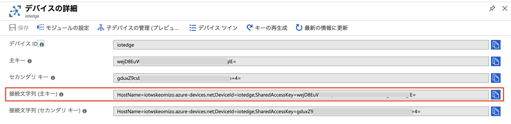

include::variables.yaml[]


## 演習: Azure IoT Edge デバイスの作成

この演習では、Azure上にデプロイしたIoT Edge用VM(Ubuntu)を利用して、異常が発生した場合にシミュレーションデータ（温度）をIoT Hubに送信します。

### タスク1：Linux VMのデプロイ

このタスクでは、IoT Edgeデバイスとして動作させる仮想マシン(Azure IoT Edge on Ubuntu)をデプロイします。

. Azure管理ポータル画面のサイドメニューから[リソースグループ]をクリックして、先に作成したリソースグループ（例. _iotws_）を選択します。

. リソースグループの[+追加]をクリックします。

. 検索フィールドに `iot edge ubuntu` として検索します。

. 検索結果の一覧から [Azure IoT Edge on Ubuntu] を選択します。

. [作成]をクリックします。

. [基本]で各種項目を設定します。
+
.設定項目と設定値
[cols="2*", options="header"]
|===
|設定項目
|設定値

|サブスクリプション
|利用するサブスクリプションを選択

|リソースグループ
|例）_iotws_

|仮想マシン名
|例）_iotedge_ （任意のマシン名）

|地域
|東日本

|可用性オプション
|インフラストラクチャ冗長は必要ありません（デフォルトのまま）

|イメージ
|Ubuntu Server 16.04 LTS + Azure Iot Edge runtime

|サイズ
|Standared B1ms（デフォルトのまま）

|認証の種類
|[パスワード]を選択

|ユーザー名
|例）_myadmin_

|パスワード
|例）_#myadmin1234_ +
次の条件を満たす、任意のパスワード +
* 12-72文字 +
* 1つの小文字、1つの大文字、1つの数字および "¥"または"-"以外の1つの特殊文字

|Azure Active Directoryでログインする（プレビュー）
|オフ

|パブリック受信ポート
|選択したポートを許可

|受信ポートを選択
|SSH(22)

|===

. [次: ディスク]で各種項目を設定します。
+
.設定項目と設定値
[cols="2*", options="header"]
|===
|設定項目
|設定値

|OSディスクの種類
|Standard SSD

|===

. [確認および作成]をクリックします。
+
※ネットワーク、管理、ゲストの構成、タグの項目は変更しないので飛ばします。

. 仮想マシンの作成内容を確認し[作成]をクリックします。

. 作成された仮想マシンを選択します。

. 概要ビューの[パブリックIPアドレス]をクリックします。

. [DNS名ラベル]を設定します。
+
.設定項目と設定値
[cols="2*", options="header"]
|===
|設定項目
|設定値

|DNS名ラベル
|任意のホスト名

|===

. 画面上部の[保存]をクリックします。

. 左側のメニューの設定セクションの[ネットワーク]をクリックします。

. 右側のPaneの[受信ポートの規則を追加]をクリックします。

. 受信セキュリティ規則の追加のダイアログでパラメータを入力します。
+
.設定項目と設定値
[cols="2*", options="header"]
|===
|設定項目
|設定値

|ソース
|Any

|ソースポート範囲
|*

|宛先
|Any

|宛先ポート範囲
|8883

|プロトコル
|TCP

|アクション
|許可

|優先度
|（デフォルトのまま）

|名前
|Port_8883

|===


### タスク2：IoT Edgeデバイスの追加

このタスクでは、IoT HubにIoT Edgeデバイスを新規登録します。

. Azureポータル画面で、本演習で利用するIoT Hubを開きます。

. IoT Hubの左側のメニューでデバイスの自動管理のセクションにある[IoT Edge]をクリックします。

. 画面上部の[IoT Edgeデバイスを追加する]をクリックします。

. パラメータを入力してIoT Edgeデバイスを追加します。
+
.設定項目と設定値
[cols="2*", options="header"]
|===
|設定項目
|設定値

|デバイスID
|例）_iotedge_

|認証の種類
|対称キー

|自動生成キー
|（チェック）

|このデバイスをIoTハブに接続する
|有効

|子デバイス
|0

|===

. [保存]をクリックします。


### タスク3： IoT Edgeランタイムの設定

このタスクでは、IoT EdgeデバイスがIoT Hubに接続するための設定をします。

. Azureポータル画面でIoT Edge用の仮想マシンを選択します。

. 画面上部の接続をクリックしてSSHでログインするコマンドをコピーします。

. クラウドシェルを起動します。

. SSHコマンドをクラウドシェルのコンソールに貼り付けて、IoT Edge用の仮想マシンにSSHでログインします。

. Azureポータル画面で本演習で利用するIoT Hubを選択します。

. IoT Hubの左側のメニューでデバイスの自動管理のセクションの[IoT Edge]をクリックします。

. 右側のPaneに表示されたIoT Edgeデバイスの一覧から登録したIoT Edgeデバイス（例. _iotedge_）を選択します。

. デバイスの詳細画面で接続文字列（主キー）をコピーします。
+


. クラウドシェルでIoT Edgeのユーザをrootユーザにスイッチします。
+
```
sudo -i
```
. IoT Edgeランタイムを構成します。
+
`/etc/iotedge/config.yaml` を編集して、デバイスの接続文字列を設定します。設定文字列の定義は26行目あたりにあります。
+
`<ADD DEVICE CONNECTION STRING HERE>` を、前のタスクでコピーしておいた接続文字列で置き換えます。

+
.編集前
```
provisioning:
  source: "manual"
  device_connection_string: "<ADD DEVICE CONNECTION STRING HERE>"
```
+
.編集後
```
provisioning:
  source: "manual"
  device_connection_string: "HostName=xxxxx;DeviceId=xxx;SharedAccessKey=xxxxxxxx"
```

. IoT Edgeランタイムを開始します
+
```
systemctl status iotedge
systemctl restart iotedge
```

. IoT Edgeランタイムのコンテナが動作していることを確認します
+
```
systemctl status iotedge
```
+
コンソールのに出力された、3行目ステータスが *active* になっていれば正常に実行されています。
+
```
● iotedge.service - Azure IoT Edge daemon
   Loaded: loaded (/lib/systemd/system/iotedge.service; enabled; vendor preset: enabled)
   Active: active (running) since Thu 2019-04-04 05:52:50 UTC; 2s ago
     Docs: man:iotedged(8)
 Main PID: 2350 (iotedged)
    Tasks: 8
   Memory: 15.9M
      CPU: 23ms
   CGroup: /system.slice/iotedge.service
           └─2350 /usr/bin/iotedged -c /etc/iotedge/config.yaml
```

. IoT Edgeランタイムのコンテナログを確認します
+
```
docker ps
docker logs edgeAgent
```
+
`watch -n 10 docker ps` のようにコマンドを実行すると、10秒間隔でdocker psコマンドを実行します。

. Azure管理ポータルから、対象のIoT Edgeデバイスを開き[最新の情報に更新]をクリックします

. デプロイされたモジュール一覧に `$edgeAgent` が追加されていることを確認します

### タスク4: Azure Stream Analytics on Edgeの作成

このタスクでは、IoT Edgeで実行する Azure Stream Analytics on Edgeを構成します。

#### タスク4-1: Stream Analytics on Edgeの作成

. Azureポータル画面で本演習で利用するリソースグループを選択します

. 画面上部の [+追加] をクリックします

. 検索フィールドに `stream analytics` と入力します

. 検索結果の一覧から [Azure Stream Analytics on IoT Edge] を選択し、[作成] をクリックします

. 新しいStream Analyticsジョブ画面でパラメータを入力します
+
.設定項目と設定値
[cols="2*", options="header"]
|===
|設定項目
|設定値

|ジョブ名
|asaonedge

|サブスクリプション
|本演習で利用するサブスクリプション

|リソースグループ
|例）_iotws_ （本演習で利用するリソースグループ）

|場所
|東日本

|ホスティング環境
|Edge

|===

. [作成] をクリックし、デプロイが完了するまで待ちます。


#### タスク4-2: ストレージの設定

. Azure Stream Analytics on Edgeの左側のメニューで構成セクションの [ストレージアカウントの設定] をクリックします。

. [ストレージアカウントの追加]をクリックします。

. ストレージアカウントの設定画面でパラメータを入力します。
+
.設定項目と設定値
[cols="2*", options="header"]
|===
|設定項目
|設定値

|ストレージアカウントの設定
|ご使用のサブスクリプションからストレージアカウントを選択する

|サブスクリプション
|本演習で利用するサブスクリプション

|ストレージアカウント
|例）_iotwsstorage_

|コンテナー
|新規作成

|（コンテナ名）
|asaonedge

|===

. [保存]をクリックします。

### タスク4-3: Stream Analyticsの入力リソースの設定

. Azure Stream Analyticsの左側のメニューのジョブトポロジのセクションの [入力] をクリックします

. 画面上部の [+ストリーム入力の追加] をクリックし、プルダウンメニューから [Edge Hub] を選択します

. Edge Hubの設定画面でパラメータを入力します
+
.設定項目と設定値
[cols="2*", options="header"]
|===
|設定項目
|設定値

|入力エリアス
|sensor

|イベントシリアル化形式
|JSON

|エンコード
|UTF-8

|イベントの圧縮タイプ
|なし

|===

. [保存] をクリックします。


### タスク4-4: Stream Analyticsの出力リソースの設定

. Azure Stream Analyticsの左側のメニューのジョブトポロジのセクションの[出力]をクリックします。

. 画面上部の [+追加] をクリックし、プルダウンメニューから [Edge Hub] を選択します。
+
.設定項目と設定値
[cols="2*", options="header"]
|===
|設定項目
|設定値

|出力エリアス
|alert

|イベントシリアル化形式
|JSON

|フォーマット
|改行区切り

|エンコード
|UTF-8

|===

. [保存] をクリックします。


### タスク4-5: Stream Analyticsのクエリの設定

. Azure Stream Analyticsの左側のメニューのジョブトポロジの[クエリ]をクリックします

. クエリを編集します。
+
ここではセンサーから送られてきたデータのうち、0度より温度が低い場合にテレメトリデータを送信します
+
```
SELECT
    *
INTO
    alert
FROM
    sensor
WHERE
  temperature < 0
```

. 画面上部の [保存] をクリックします。


### タスク5: Azure Stream AnalyticsをIoT Edgeにデプロイ

このタスクでは、Azure Stream Analytics JobをIoT Edgeにデプロイし、ストリーム処理をエッジ側でできるようにします。

. Azureポータル画面で本演習で利用するIoT Hubを選択します

. IoT Hubの左側のメニューでデバイスの自動管理のセクションの [IoT Edge]をクリックします

. IoT Edgeデバイス一覧から本演習で利用するIoT Edgeデバイス（例.　_iotedge_）を選択します

. デバイスの詳細画面の上部の [モジュールの設定]をクリックします

. モジュールの設定 - モジュールの追加画面の真ん中あたりにある [+追加] をクリックし、プルダウンメニューから [Azure Stream Analyticsモジュール] を選択します
+
image::Images/iotedge_add_asajob.png[]

. IoT Edgeの展開画面でパラメータを入力します。
+
.設定項目と設定値
[cols="2*", options="header"]
|===
|設定項目
|設定値

|サブスクリプション
|本演習で利用するサブスクリプション

|Edgeジョブ
|asaonedge

|===

. [保存] をクリックします。

. モジュールの設定 - モジュールの追加画面に戻ったら [次へ] をクリックします。

. メッセージルートの設定を編集します。
+
```
{
  "routes": {
    "sensorToAsa": "FROM /messages/* WHERE NOT IS_DEFINED($connectionModuleId) INTO BrokeredEndpoint(\"/modules/iotwsasaonedge/inputs/sensor\")",
    "alertToCloud": "FROM /messages/modules/iotwsasaonedge/outputs/* INTO $upstream"
  }
}
```
+
ここで設定するルートは2つです。一つ目の `sensorToASA` は、デバイスから受信したメッセージを Stream Anaytics on Edgeの入力リソースにルーティングします。二つ目の `alertToCloud` は Stream Anaytics onEdgeの出力をクラウド上のIoT Hubに送信します。
+
sensorToASAのルーティングルールで `WHERE NOT IS_DEFINED($connectionModuleId)` を条件に指定することで、リーフデバイスから送信されたメッセージのみを対象とします。
+
[NOTE]
====
なんでもクラウド上のIoT Hubに送信する場合
```
    "route": "FROM /messages/* INTO $upstream",
```
====

. 画面下部の [次へ] をクリックします。

. デプロイの確認画面で [送信] をクリックします。

. モジュールの設定-デプロイの確認画面の右下の [送信] をクリックします。


### タスク6 : IoT Edgeデバイスのゲートウェイ構成

このタスクでは、IoT Edgeをゲートウェイとして機能しリーフデバイスからのメッセージを受信できるようにします。

#### タスク6-1 : 証明書作成の準備

このタスクでは、IoTデバイスがIoT Edgeに接続するときに利用する証明書を生成します。

. IoT EdgeデバイスにSSHでログインします

. rootユーザに変更します
+
```
sudo -i
```

. 証明書を生成するツールを取得します。
+
```
git clone https://github.com/Azure/azure-iot-sdk-c.git
```

. 作業用ディレクトリを作成して移動します。
+
```
mkdir ws
cd ws
```

. 構成ファイルとスクリプトファイルを作業用ディレクトリにコピーします。
+
```
cp ../azure-iot-sdk-c/tools/CACertificates/*.cnf .
cp ../azure-iot-sdk-c/tools/CACertificates/certGen.sh .
```

. スクリプトファイルのパーミッションを変更します。
+
```
chmod 700 certGen.sh
```

### タスク6-2: 証明書の作成

このタスクでは3つの証明書を作成し、それらをチェーンで接続します。
作成した証明書は、IoT EdgeおよびIoTデバイスにインストールして利用します。

. 所有者CA証明書と中間証明書を作成します
+
```
./certGen.sh create_root_and_intermediate
```

. 証明書ができていることを確認します
+
* ./certs/azure-iot-test-only.root.ca.cert.pem
* ./certs/azure-iot-test-only.intermediate.cert.pem
* ./private/azure-iot-test-only.root.ca.key.pem
* ./private/azure-iot-test-only.intermediate.key.pem
+
```
ls -1 certs private

＜＜＜ 以下のファイルが表示される＞＞＞
certs:
azure-iot-test-only.chain.ca.cert.pem
azure-iot-test-only.intermediate.cert.pem
azure-iot-test-only.root.ca.cert.pem

private:
azure-iot-test-only.intermediate.key.pem
azure-iot-test-only.root.ca.key.pem
```

. Edgeデバイス証明書と秘密キーを作成します
+
スクリプトがバグってるっぽいので、355行目からはじまる IF 文を編集してから実行。
+
変更前 ::  `if [$# -ne 1]; then`
変更後 :: `if [ $# -ne 1 ]; then`
+
スクリプトを編集後、次のコマンドを実行して証明書を作成します。
```
./certGen.sh create_edge_device_certificate "<IoT Edge DeviceのFQDN>"
```
+
※ iotedgeはIoT Edgeデバイスのホスト名を指定します。

. 作成されたファイルを確認します。
+
```
ls -1 certs private

＜＜＜以下のファイルが一覧される＞＞＞
certs:
azure-iot-test-only.chain.ca.cert.pem
azure-iot-test-only.intermediate.cert.pem
azure-iot-test-only.root.ca.cert.pem
new-edge-device.cert.pem
new-edge-device.cert.pfx

private:
azure-iot-test-only.intermediate.key.pem
azure-iot-test-only.root.ca.key.pem
new-edge-device.key.pem
```


. 所有者CA証明書、中間証明書、EdgeデバイスCA証明書から証明書チェーン `new-edge-device-full-chain.cert.pem` を生成します
+
```
cat ./certs/new-edge-device.cert.pem ./certs/azure-iot-test-only.intermediate.cert.pem ./certs/azure-iot-test-only.root.ca.cert.pem > ./certs/new-edge-device-full-chain.cert.pem
```

. 作成されたファイルを確認します。
+
```
ls certs/new-edge-device-full-chain.cert.pem
```

### タスク6-3: IoT Edge デーモンの構成変更

このタスクでは、IoT Edgeデバイスで実行するiotedgeデーモンが証明書を参照できるように構成ファイルを編集します。

. 証明書ファイルをコピーします。
+
```
mkdir /etc/iotedge/certs
mkdir /etc/iotedge/private

cp /root/ws/certs/new-edge-device-full-chain.cert.pem /etc/iotedge/certs
cp /root/ws/private/new-edge-device.key.pem /etc/iotedge/private
cp /root/ws/certs/azure-iot-test-only.root.ca.cert.pem /etc/iotedge/certs
```

. `/etc/iotedge/config.yaml` を編集します。
+
```
certificates:
  device_ca_cert: "/etc/iotedge/certs/new-edge-device-full-chain.cert.pem"
  device_ca_pk: "/etc/iotedge/private/new-edge-device.key.pem"
  trusted_ca_certs: "/etc/iotedge/certs/azure-iot-test-only.root.ca.cert.pem"
```


### タスク6-4 : IoTデバイスをIoT Edgeゲートウェイに接続

. IoTデバイスにSSHでログインします。

. root ユーザになります
+
```
sudo -i
```

. CA証明書をIoT Edgeからコピーします
+
```
scp myadmin@<IoT EdgeのFQDN>:/etc/iotedge/certs/azure-iot-test-only.root.ca.cert.pem azure-iot-test-only.root.ca.cert.pem
```

. IoTデバイスに証明書をインストールします
+
```
cp azure-iot-test-only.root.ca.cert.pem /usr/local/share/ca-certificates/azure-iot-test-only.root.ca.cert.pem.crt

update-ca-certificates
```

. 証明書を使って IoT Edgeゲートウェイに接続できることを確認します
+
```
openssl s_client -connect <IoT EdgeのFQDN>:8883 -CAfile /usr/local/shareca-certificates/azure-iot-test-only.root.ca.cert.pem.crt -showcerts
```

. IoTデバイスクライアントアプリケーションの接続文字列を編集します。
+
IoT Deviceから、クラウド上のAzure IoT Hubに接続する場合は、`HostName=[IoTHubのFQDN];DeviceID=[デバイスID];SharedAccessKey=[SharedAccessKey];` を指定します。
+
IoT Edgeに接続する場合には、`HostName=[IoTHubのFQDN];DeviceID=[デバイスID];SharedAccessKey=[SharedAccessKey];GatewayHostName=[IoTEdgeのFQDN]` のように、GatewayHostNameとしてIoTEdgeのFQDNも指定します。
+
例
+
```
CONNECTION_STRING = "HostName=iotwskeomizohub.azure-devices.net;DeviceId=iotdevice;SharedAccessKey=oEjHD4KAVKzLMPoOC3YyzNk9kDPe1JOAAAAAAAAAAAA=;GatewayHostName=iotwsedgekeomizo.japaneast.cloudapp.azure.com"
```

### タスク7 : デバイスからテレメトリデータを送信

このタスクでは、IoT Edgeゲートウェイを経由してリーフデバイスから送信されたテレメトリデータがクラウド上のIoT Hubに送信されていることを確認します。

. デバイス用のVMにSSHでログインします

. デバイスクライアントのプログラムを実行します
+
```
python SimulatedLeafDevice.py
```


#### タスク7-1: クラウドのBlob Storageを確認
. Azureポータル画面で本演習で利用するリソースグループを選択します

. リソースグループ一覧からストレージアカウントをクリックします

. blobストレージをクリックして、受信データが保存されているフォルダーをクリックします

. ファイルを選択し、画面上部の[Blobの編集]をクリックしてblobの内容を確認します


### タスク8: Azure Stream Analytics on Edgeを利用した異常検知

本タスクでは、Azure Stream Analytics on Edgeのクエリを編集し、異常検知の関数を利用して異常時のみクラウドのテレメトリデータを送信するように変更します。

. Azureポータル画面で、本演習で利用するStream Analytics on Edgeを選択します

. Stream Analyticsの画面の左側のメニューで[クエリ]をクリックします

. クエリの編集画面でクエリを編集します
+
```
WITH
AnomalyDetectionStep AS
(
    SELECT
        EventEnqueuedUtcTime AS time,
        CAST(temperature AS float) AS temp,
        AnomalyDetection_SpikeAndDip(CAST(temperature AS float), 95, 120, 'spikesanddips')
            OVER(LIMIT DURATION(second, 120)) AS SpikeAndDipScores
    FROM sensor
),
AnomalyDetectionStepResult AS
(
    SELECT
        time,
        temp,
        CAST(GetRecordPropertyValue(SpikeAndDipScores, 'Score') AS float) AS
        SpikeAndDipScore,
        CAST(GetRecordPropertyValue(SpikeAndDipScores, 'IsAnomaly') AS bigint) AS
        IsSpikeAndDipAnomaly
    FROM
        AnomalyDetectionStep
)
SELECT
        time,
        temp,
        SpikeAndDipScore,
        IsSpikeAndDipAnomaly
INTO
    alert
FROM
    AnomalyDetectionStepResult
WHERE
    IsSpikeAndDipAnomaly = 1
```

. クエリ編集Paneの上部の[保存]をクリックしてクエリを保存します

. Azureポータル画面で本演習で利用するIoT Hubを選択します

. IoT Hubの画面の左側のメニューでデバイスで[IoT Edge]をクリックします

. IoT Edgeデバイスの一覧から本演習で利用するIoT Edge(ex. __iotedge__)を選択します

. デバイスの詳細画面の上部にある[モジュールの設定]をクリックします

. デプロイモジュールの一覧で[iotwsasaonedge]をクリックします

. IoTカスタムモジュールのダイアログで[ASAモジュールの更新]をクリックし、ダイアログの下部の[保存]をクリックします

. モジュールの設定_モジュールの追加（省略可能）画面左下の[次へ]をクリックします

. モジュールの設定_ルートの指定（省略可能）画面左下の[次へ]をクリックします

. モジュールの設定_デプロイの確認画面右下の[送信]をクリックします


### タスク9 : IoT Hubのメッセージルーティングの設定

このタスクでは、IoT Edgeから受信した警告メッセージをIoT Hubのメッセージルーティングを利用してBlobに出力します。

. Azureポータル画面で本演習で利用するIoT Hubを選択します

. IoT Hubの左側のメニューからメッセージセクションのメッセージルーティングをクリックします

. 右側のPaneでルートタブ選択し、中央あたりの[+追加]をクリックします

. エンドポイント入力フィールドの右の[+追加]をクリックし、プルダウンメニューから[Blobストレージ]を選択します

. ストレージエンドポイントの追加ダイアログでパラメータを入力します
+
.設定項目と設定値
[cols="2*", options="header"]
|===
|設定項目
|設定値

|エンドポイント名
|任意の文字列（例. __fromEdge__）

|Encoding
|JSON

|BLOBファイル名形式
|{iothub}/{partition}/{YYYY}/{MM}/{DD}/{HH}/{mm} +
デフォルトのまま

|===

. [コンテナーを選択します]をクリックします

. 本演習で利用するストレージアカウントを選択します（例. __iotwsstorage__）

. コンテナー画面で[+コンテナー]をクリックし、新しいコンテナーダイアログでパラメータを入力します
+
.設定項目と設定値
[cols="2*", options="header"]
|===
|設定項目
|設定値

|名前
|任意の文字列（例. __fromEdge__）

|パブリックアクセスレベル
|コンテナー

|===

. コンテナー画面でコンテナー一覧から作成したコンテナーをクリックし、画面下部の[選択]をクリックします

. ストレージエンドポイントの追加画面で[作成]をクリックします

. ルートの追加画面に戻りパラメータを入力します
+
.設定項目と設定値
[cols="2*", options="header"]
|===
|設定項目
|設定値

|名前
|任意の文字列（例. __fromEdge__）

|エンドポイント
|Blobのエンドポイント（例. __fromEdge__）

|ルートの有効化
|有効

|ルーティングクエリ
|$connectionDeviceId = 'iotedge' +
*iotedge* という名前で登録されたIoTエッジデバイスのみをルーティングの対象とします

|===

. [保存]をクリックします


## タスク10: IoT Edgeをゲートウェイとしたクラウドへのメッセージの送信

このタスクでは、IoTデバイスから送信されたテレメトリデータをIoT Edgeで判定し、異常があった場合だけクラウドにメッセージが送信されていることを確認します。

. IoT Edge用仮想マシンにログインして、IoT Edgeのステータスを確認します
+
```
sudo -i

systemctl status iotedge
```

. IoTデバイス用仮想マシンにログインして、アプリケーションを実行します
+
```
cd azure-iot-samples-python/iot-hub/Quickstarts/simulated-device-2

python SimulatedLeafDevice.py
```

. Azureポータル画面でIoT Hubのメッセージルーティングの出力先のBlobストレージを確認します

[NOTE]
====
Blobストレージに保存されたメッセージボディはbase64エンコーディングされています。
====

. Cloud Shellを開始します

. Base64 エンコードされたBodyメッセージをコピーします

. base64 コマンドを使ってデコードします
+
```
echo "コピーした文字列" | base64 -d
```
